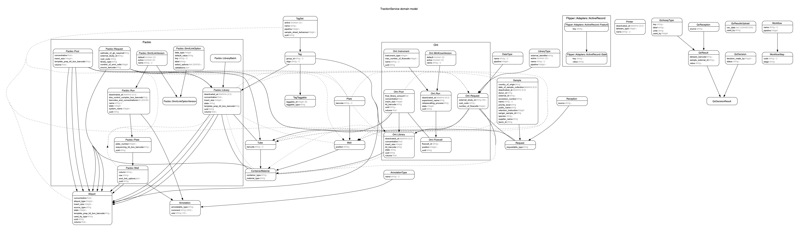

# Traction service

Rails app which exposes a RESTful API.

## Requirements

1. Ruby (check `.ruby-version` for the version) and ruby version manager
1. Bundler `gem install bundler`
1. Graphviz (for mac OS `brew install Graphviz`)
1. OpenSSL
1. MySQL `brew install mysql`

## Installation

1. Install using: `bundle install`
1. Remove the `.example` from the config files in `config` folder

## Database setup

To create the database for a fresh install: `bundle exec rails db:setup`

To create a set of enzymes (needed for saphyr dummy runs): `bundle exec rails enzymes:create`

To create the first set of tags (needed for pacbio dummy runs): `bundle exec rails tags:create`

To create pacbio dummy runs: `bundle exec rails pacbio_runs:create`

To create saphyr dummy runs: `bundle exec rails saphyr_runs:create`

## Database drop

To drop the database `bundle exec rails db:drop`

## Tests
To run the unit tests run rspec. `bundle exec rspec`

We use rubocop to keep the code clean `bundle exec rubocop`

## Running

To run the rails application `bundle exec rails s`

When running with Traction-UI, UI expects the service to be on port 3100. `PORT=3100 rails s`

## Messages - RabbitMQ

Sending messages is disabled by default but if you would like to test messages, install a broker
(RabbitMQ) and update the config in `config/bunny.yml`.

## Miscellaneous

### Rails

To see all the commands available from rails: `bundle exec rails -T`

### ERD

An ERD was created using the `rails-erd` gem by executing: `bundle exec erd`

## Releases

#### UAT
On merging a pull request into develop, a release will be created with the tag/name `<branch>/<timestamp>`

#### PROD
Update `.release-version` with major/minor/patch. On merging a pull request into master, a release will be created with the release version as the tag/name 