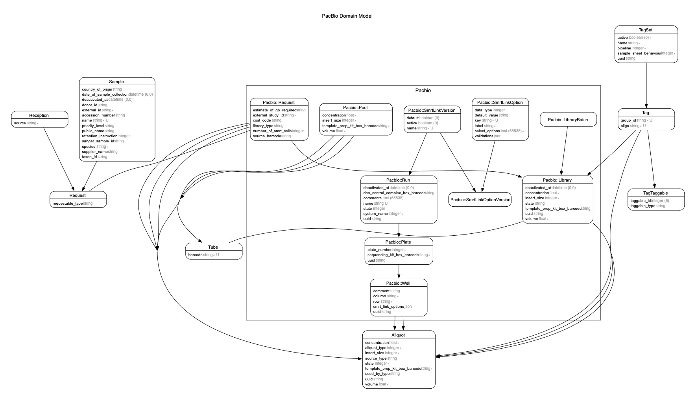

# Traction service

Rails app which exposes a RESTful API for a Long Read LIMS

- Add details aboout traction ui
- importing samples from external sources currently:
  - Sequencescape
  - Samples extraction
- creating libraries
- creating pools of libraries with support for multiplexing
- creating sequencing runs
- printing sample sheets
- supports the following technologies:
  - Saphyr
  - Pacbio
  - ONT (In progress)

## Requirements

1. Ruby (check `.ruby-version` for the version) and ruby version manager
1. Bundler `gem install bundler`
1. Graphviz (for mac OS `brew install graphviz`)
1. OpenSSL
1. MySQL `brew install mysql@8.0`

## Installation

1. Run `bin/setup`

This will:

- Run bundle install
- Create copies of any .example files
- Create the database
- Seed basic data such as library types and tags.

Note:

- If the mysql-client cannot be found (possibly due to the homebrew installation path not being the default), the `mysql2` gem will fail to install with the exception:

  ```text
  ...
  /Users/<user>/.rbenv/versions/3.1.2/lib/ruby/3.1.0/mkmf.rb:1086:in `block in find_library': undefined method `split' for nil:NilClass (NoMethodError)
  ...
  ```

- The fix is to add mysql@8.0 binaries to the PATH [[^1](https://stackoverflow.com/a/69106302)] similar to the following:

  ```shell
  export PATH=$PATH:(brew --prefix)/opt/mysql@8.0/bin
  ```

## Database setup

The database should have been generated as part of the installation step above.
If you need to create the database afresh: `bundle exec rails db:reset`.

### Seeded data

The following tasks are run automatically by `rails db:seed` at the end of the
setup process

- To create all the supported library types: `bundle exec rails library_types:create`
- To create all the supported data types: `bundle exec rails data_types:create`
- To create a set of enzymes (needed for saphyr dummy runs): `bundle exec rails enzymes:create`
- To create all of the pacbio tags (needed for pacbio dummy runs): `bundle exec rails tags:create:pacbio_all`
- To create pacbio Qc Assay Types: `bundle exec rails qc_assay_types:create`
- To create pacbio smrt link versions: `bundle exec rails smrt_link_versions:create`
- To create ont instruments: `bundle exec rails ont_instruments:create`
- To create the tree of life tubes report view: `bundle exec rails tol_tubes_report_view:create`

### Useful support data

To create pacbio dummy runs: `bundle exec rails pacbio_data:create`

To create saphyr dummy runs: `bundle exec rails saphyr_runs:create`

To create ont dummy runs: `bundle exec rails ont_data:create`

To create dummy printers: `bundle exec rails dummy_printers:create`

## Database drop

To drop the database `bundle exec rails db:drop`

## Tests

To run the unit tests run rspec. `bundle exec rspec`

We use rubocop to keep the code clean `bundle exec rubocop`

## Running

To run the rails application `bundle exec rails s`

When running with Traction-UI, UI expects the service to be on port 3100. `PORT=3100 rails s`

## Messages - RabbitMQ

Sending messages is disabled by default but if you would like to test messages, install a broker
(RabbitMQ) and update the config in `config/bunny.yml` by enabling the development settings.

After installing RabbitMQ, you will need to create the exchange you will be sending messages over.
You can do this by issuing a command in your terminal such as

```shell
rabbitmqadmin declare exchange name="bunny.examples.exchange" type="topic"
```

making sure you match the exchange name with the one specified in `config/bunny.yml`.

A web interface to administrate RabbitMQ is always available at [http://localhost:15672/](http://localhost:15672/) once the service is running.

## Sample sheets

Sample sheets can be generated for upload to SMRT Link.

For more details see the notes on the [Sample Sheet Generator](app/exchanges/README.md).

## Miscellaneous

### Git commit hook

You may wish to enable the provided git commit hook if you want to be notified of rubocop issues in the files you've edited before they are committed.
To do this, refer to the documentation in `.githooks/README.txt`.

### Rails

To see all the commands available from rails: `bundle exec rails -T`

### Sample Sheet Downloads

Sample sheets can be downloaded en masse for debugging and development purposes using the `download_sample_sheets` command in the `scripts` directory. See the [scripts README](scripts/README.md) for more information.

### Entity-Relationship Diagrams

An ERD was created using the `rails-erd` gem by executing: `bundle exec erd`


A custom PacBio ERD was created using the `.erd.pacbio.erdconfig` config by executing: `bundle exec erd --config .erd.pacbio.erdconfig`



Should the ERD fail to generate with the message `Failed: ArgumentError: bad value for range`, apply the patch below:

```diff
diff --git a/app/models/ont/run.rb b/app/models/ont/run.rb
index 4dd7083e..d3bde752 100644
--- a/app/models/ont/run.rb
+++ b/app/models/ont/run.rb
@@ -42,7 +42,7 @@ module Ont
       message: :run_min_flowcells
     }
     validates :flowcells, length: {
-      maximum: :max_number_of_flowcells, if: :max_number_of_flowcells,
+      maximum: 2, # :max_number_of_flowcells, if: :max_number_of_flowcells, # TODO: fix failing ERD
       message: :run_max_flowcells
     }
```

## Releases

### UAT

On merging a pull request into develop, a release will be created with the tag/name `<branch>/<timestamp>`

### PROD

Update `.release-version` with major/minor/patch. On merging a pull request into master, a release will be created with the release version as the tag/name

See Confluence for further information

## Documentation

We've used Yard as the documentation tool to document the service. This can be accessed via https://sanger.github.io/traction-service/.

To query all the `@todo` items in Yard, the following command can be used:

```shell
bundle exec yard list --query '@todo'
```

### Adding Sub-documentation

It is possible to add comprehensive documentation about the areas in each application. For example, in this repository, we have added a documentation on how volume tracking works. The process to add these sub-documentation is as follows.

**Prerequesites**

Install a recent version of Python. Python is used for the `mkdocs` tool we use to generate documentation. Please install `mkdocs` using `pip install mkdocs` following installing Python.

1. Navigate to `documentation` directory.
2. Create a new `mkdocs` documentation with `mkdocs new <sub documentation name>`. Please be aware that this `sub documentation name` will be the route you'll have use to navigate to the documentation. For example, if it's volume-tracking, you'll have to navigate to `sanger.github.io/traction-service/volume-tracking` to access documentation.
3. Use markdown to write up the documentation in the newly generated directory's `doc` subdirectory.

A CI action will automatically push the documentation upon master releases. If you want to deploy the documentation manually, you can the [manual dispatch](https://github.com/sanger/traction-service/actions/workflows/generate_pages.yml) action.
