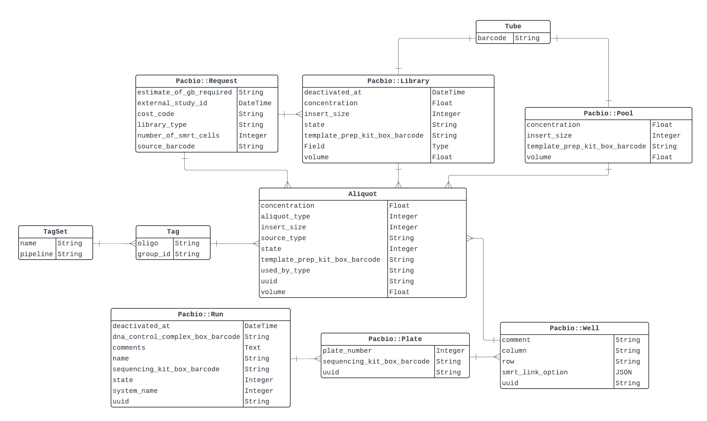
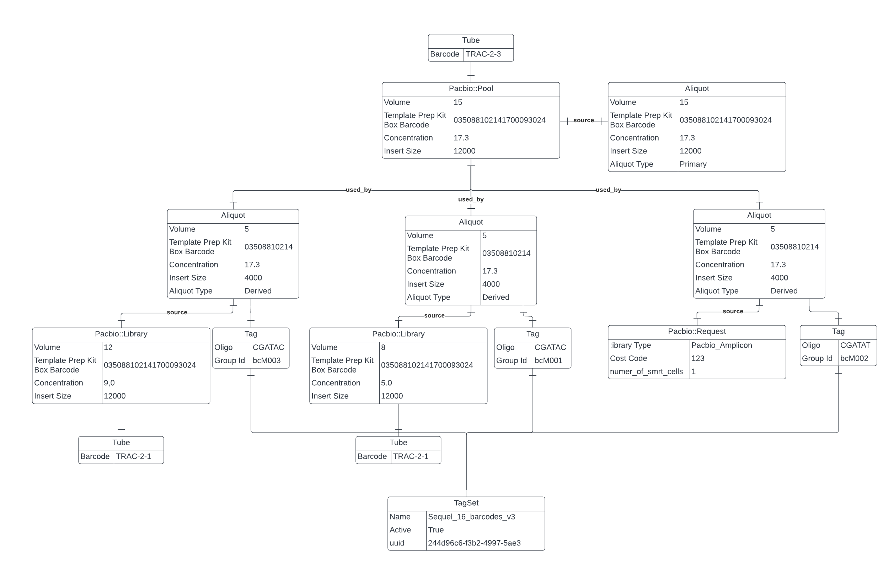

# Architectural Overview

As mentioned in the [Multiplexing process overview](index.md), the multiplexing architecture is mainly based around the creation and use of pools. This document will provide an overview of the architecture of the multiplexing system, including the responsibilities of each component and how they interact with each other with a focus on pools.

## Entity Relationship Diagram

In order to understand the architecture of the multiplexing system, it is important to understand the entities involved in the system. The following diagram shows the relevant entities and their relationships.

!!! note

    While both PacBio and ONT Traction pipelines support multiplexing and pooling, the entities and relationships shown in the diagram are specific to the PacBio Traction pipeline. The main difference between the two is the use of polymorphic aliquots and the ability to use premade libraries in the PacBio pipeline.

<figure markdown="span">
    
    <figcaption>Entities used for Multiplexing/Pooling in PacBio Traction</figcaption>
</figure>

### Understanding the entities

**TagSet**: Represents a set of tags that are used to tag samples in a pool. This entity contains information about the tag set, such as the name and the pipeline it is used in.

**Tag**: Represents a tag that is used to tag a sample in a pool. A tag belongs to a tag set and can be used in multiple pools. This entity contains information about the tag, such as the oligo/sequence. Tag oligos are unique within a tag set and only one tag set is allowed to be used per pool.

**Tube**: A wrapper entity that represents a physical tube and gives libraries and pools their Traction IDs (barcodes). A tube can have one item, typically a sample, library or pool.

**Pacbio::Request**: Represents an instance of a sample in Traction. This is the entity that is used to link back to the actual sample to retrieve related data like sample name. It also contains extra metadata about the sample, such as the source barcode, the library type and the cost code.

**Pacbio::Library**: Represents a library that is created from a request (sample). A library can only have one request where as a request can belong to many libraries. This entity contains information about the library, such as the volume, concentration, insert size, and the library kit used to create the library.

**Pacbio::Pool**: Represents a pool that is created from one or more libraries or requests (samples). A pool can have many libraries and a library can belong to many pools. This entity contains information about the pool, such as the total volume, concentration, insert size. It relates to pools and requests (samples) via the `aliquot` entity using polymorphism.

**Aliquot**: Represents a polymorphic entity that describes a piece of something that has been used somewhere. The `source` is a polymorphic representation of where is has come from, typically a request or library. The `used_by` is a polymorphic representation of where it has been used, typically a pool or well. An Aliquot can have two types, `primary` and `derived`. A `primary` aliquot is one that represents an entities initial state, such as initial volume, whereas a `derived` aliquot is one that is created from a primary aliquot and will have a volume of how much has been 'used' in that instance.

**Pacbio::Well**: Represents a well that is used on a sequencing plate. A well typically has one pool or library but can can have any number of pools and libraries via aliquot polymorphism. This entity contains information about the well, such as the column and row from the plate it is on. It can belong to just one plate.

**Pacbio::Plate**: Represents a plate that is used in a sequencing run. A plate can have many wells. This entity contains information about the plate, such as the plate number and the plate sequencing kit box barcode.

**Pacbio::Run**: Represents a sequencing run that is setup in Traction. A run can have any number of plates, typically one or two. This entity contains information about the run, such as the run name, the sequencing kit used, the state and the system used.

### Using the entities

Using the entities above, an illustrated simple example of a multiplexed pool is shown below with some example data:

<figure markdown="span">
    
    <figcaption>Example of a Multiplexed Pool</figcaption>
</figure>

Some important points to note about the example:

- The `used_by` and `source` relationships are shown coming from the `Aliquot` entity are polymorphic relationships stored as fields in `Aliquot`. The `source` is the entity that the aliquot has come from, and the `used_by` is the entity that the aliquot has been used in.
- Aliquots can have a source of either a `Pacbio::Library` or a `Pacbio::Request`. 
- A pool has two types of aliquot, a single `primary` and mutliple `derived`. Primary aliquots are created from the pool and match the pool's total volume and concentration and act as the initial state of the pool. Derived aliquots are created from their source (library or request) and are used_by the pool to represent how much of the source has been used by the pool.
- Pacbio::Library's have their own tube as they are created before this pooling process and assigned their own barcode.
- Pacbio::Library's link back to their sample through their own Pacbio::Request but it is not shown here for simplicity.
- Pacbio::Request parent data is not shown here but it would be used to link back to the actual sample data through an imported plate or tube.

## Architectural decisions

PacBio pooling used to be the same as ONT pooling in Traction. Pools could only support requests in the UI, and then in traction-service libraries would be created in the background automatically from those requests upon pool creation. Pools would also be directly related to libraries instead of relating through aliquots. This was changed to make pools more flexible and allow pre-made libraries to be added to pools in the UI as it was closer aligned to what the lab were doing in reality. The current approach of using aliquots also gives us a flexible and extensible way to manage pools. In the future we could add other entities to be used in pools such as other pools.
