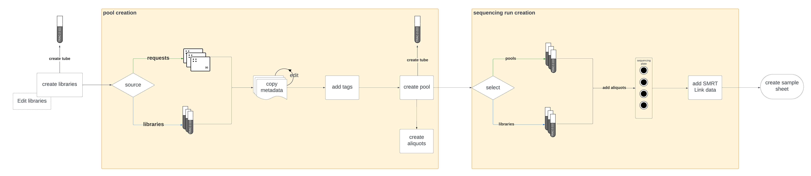

# Multiplexing process overview

## Introduction

Traction represents the multiplexing process through the creation and use of pools. A pool is a collection of libraries (tagged samples) that are combined together for sequencing. Each library/sample in the pool is tagged with a unique tag from a given tag set. The pool itself has some metadata about what it contains namely: total volume, concentration and insert size. These pools are used in sequencing runs as single entities whilst representing the individual libraries within the pool. Once a sequencing run has been setup a sample sheet may be generated where the pool's contents are then represented in a single flowcell/well containing all the pool's samples and library data.

A visual representation of the multiplexing process is shown below:

## Basic process

The basic process of multiplexing in Traction is as follows:

1. Samples are imported into Traction and requests are created for them.
    - Typically imported on plates or tubes with barcodes from Sequencescape.
2. Libraries are created from the requests.
    - Library metadata includes volume, concentration, insert size and library kit.
    - Tags may be assigned to the libraries at this stage.
3. Pools are created from the libraries.
    - Users specify which libraries they would like to add to the pool.
    - Requests can also be added to the pool directly from the plates/tubes they were imported on.
    - A single tag set is used and issued to all libraries in the pool if there is more than 1 entity in the pool. Each library in the pool is tagged with a unique tag from the tag set.
    - Pool metadata includes total volume, concentration, insert size.
4. Pools are used in sequencing runs.
    - Pools are added to wells on plates for sequencing.
5. A sample sheet is generated.
    - The sample sheet contains the pool's contents and metadata.
    - The sample sheet is used to setup the sequencing run on the sequencing machines.

## Alternative multiplexing strategies

Traction also supports multiplexing at the sequencing run level where multiple pools or libraries are combined together in a single flowcell/well in a run. This is generally less common as it is more complex, requiring consistent tagging across multiple pools/libraries in order to work. However, it is supported in Traction and can be used if required.
