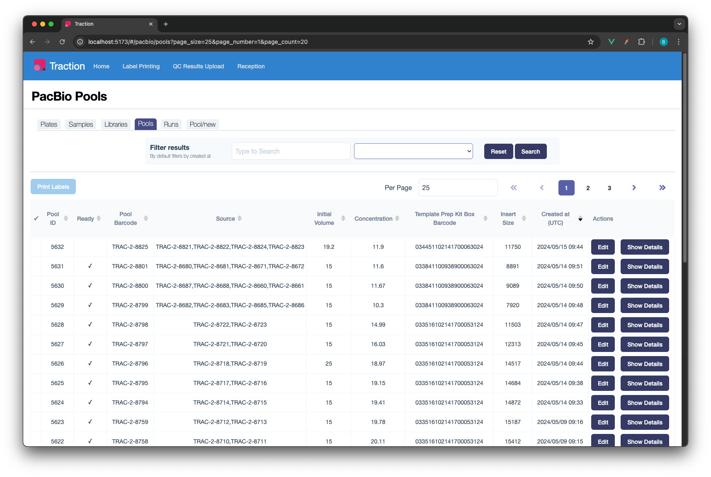
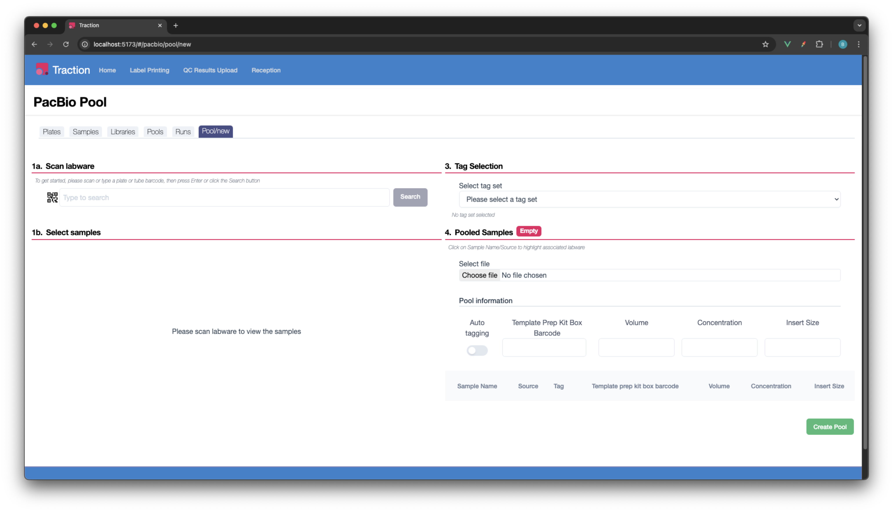
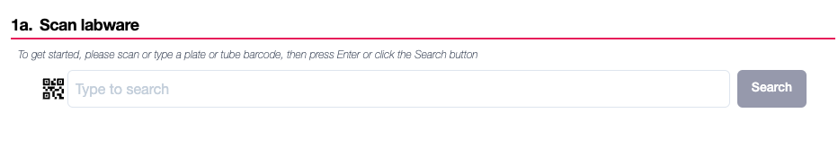
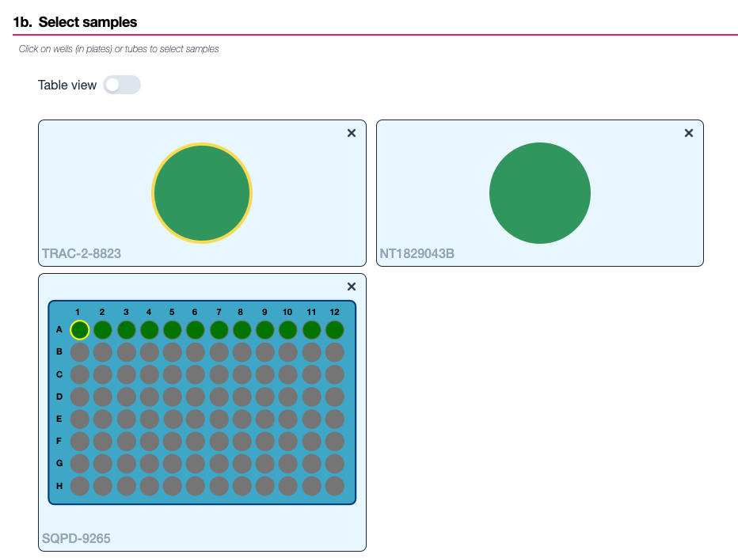
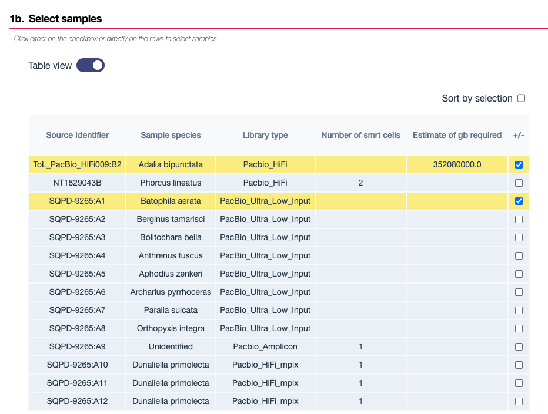
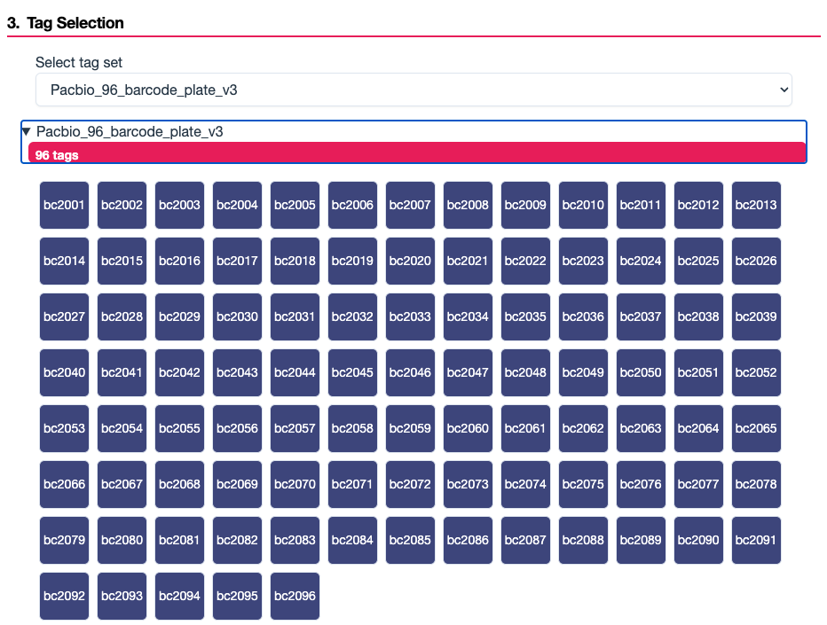
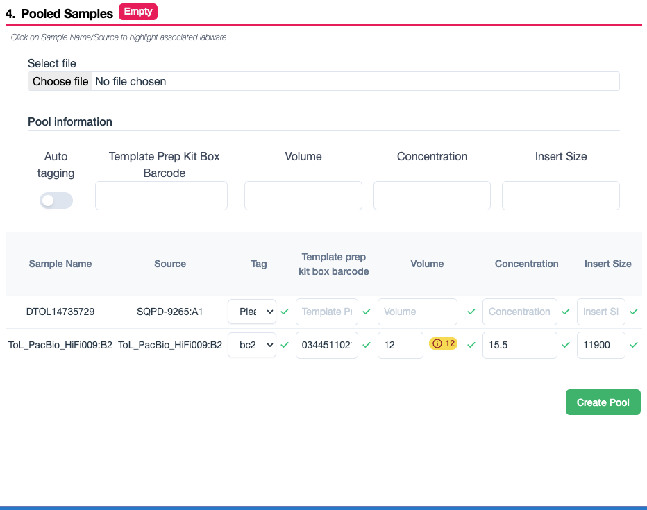
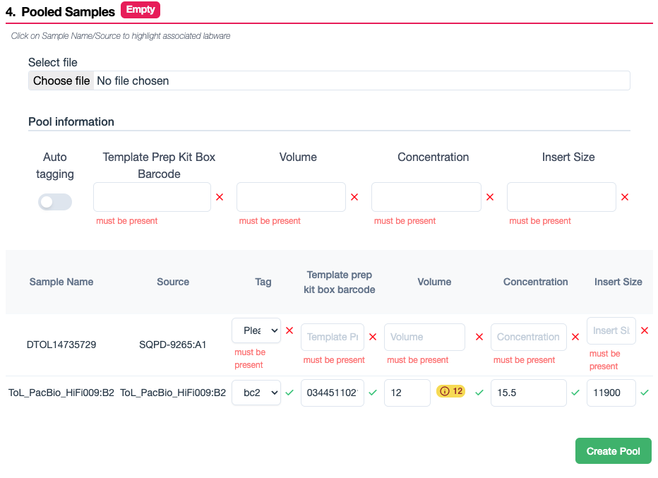
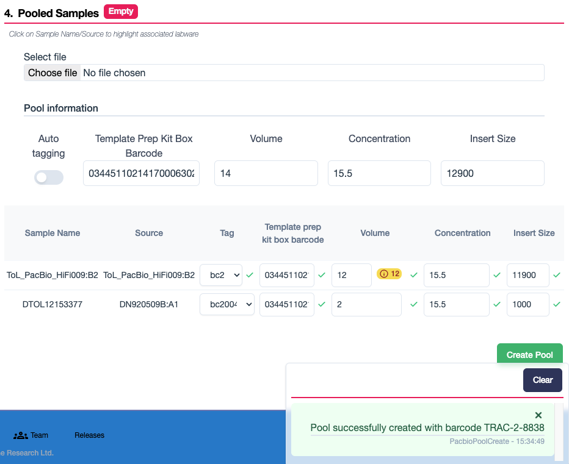
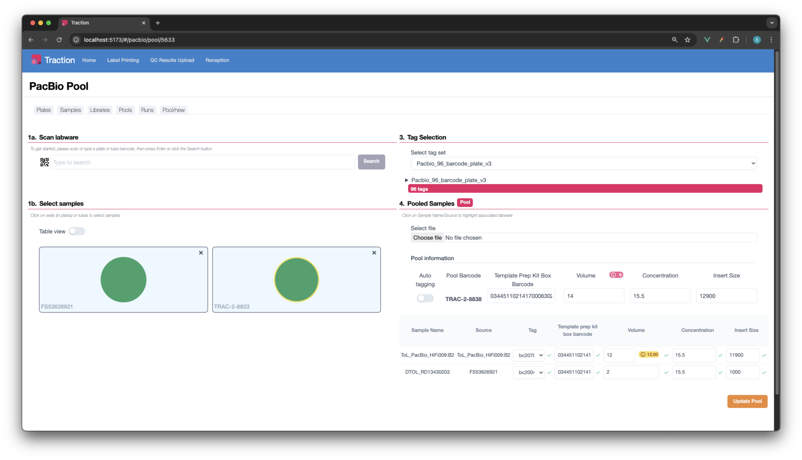

# User guide

???+ Info
    This guide predominantly describes [Traction-UI](https://github.com/sanger/traction-ui) features. If you are unfamiliar with Traction-UI it would be beneficial to familiarise yourself with it first.

## Overview

This document describes the steps that a user must follow to use the pooling features in Traction.

Pools are available to view and use in both the ONT and PacBio pipelines in Traction. This documentation will focus on the PacBio pipeline, but the steps are similar for the ONT pipeline.
Both pipelines have a dedicated pools tab available at `traction/<pipeline>/pools` where traction is the URL of the Traction UI instance and pipeline is either `ont` or `pacbio`.
Below is an example of the pools index page in the PacBio pipeline:

<figure markdown="span">
    
    <figcaption>Pools index page</figcaption>
</figure>

Like other index pages in Traction it has the standard features: a search bar with filters, a table of pools with pagination, a print labels button and a link to edit each pool and show more details.
Some notable columns in the pools table include:

- **Ready**: Whether a pool is ready for sequencing. This is determined by whether the pool has any missing data. If a pool is not ready, the missing data will be displayed after pressing show details.
- **Pool Barcode**: The barcode of the pool.
- **Source**: A list of sources that make up the pool. These are either library barcodes or request sources like plates and tube barcodes.
- **Actions**: A button to take users to edit that particular pool and a show details button to view more information about the pool.

## Creating a pool

To create a new pool go to the `pool/new` tab in your given pipeline, available at `traction/<pipeline>/pool/new` where traction is the URL of the Traction UI instance and pipeline is either `ont` or `pacbio`. The `pool/new` page should look like the following:

<figure markdown="span">
    
    <figcaption>Pool new page</figcaption>
</figure>

The page has 4 numbered, chronologicas sections which will be explored in more detail below.

### 1a. Scan labware

This search box in the top left of the page is the first step in creating a pool. Here you scan in the barcodes of any libraries, plates or tubes you wish to include in the pool. If the labware barcode cannot be found a `No labware found` error will appear in the Traction error stack. If successful, the labware will be added to the list below the search box in section 1b.

<figure markdown="span">
    
    <figcaption>Scan labware</figcaption>
</figure>

### 1b. Select samples

This section displays the labware that has been scanned in section 1a. Here you can select the samples you wish to include in the pool by clicking on the sample you wish to select. Selected samples will appear with a yellow ring around them. In order to remove a sample from the pool, simply click the sample again. If you wish to remove a scanned in labware you can click the `x` button in the top right of the corner.

<figure markdown="span">
    
    <figcaption>Select samples</figcaption>
</figure>

In the example above, TRAC-2-8823 (library), NT1829043B (tube), SQPD-9265 (plate) have been scanned in. The user has selected 2 samples to include in the pool, indicated by the green circles with a yellow ring around them.

There is also an alternate table view for this section. This can be toggled by clicking the `Table view` button in the top left of the section. This view is useful for when there are many samples to select from, or you would like to see the sample metadata. This table also has the ability to sort by selection, which will show the samples used in the pool at the top. Similarly to the grid view, samples can be selected by clicking on them and are indicated as selected by the yellow highlight.

<figure markdown="span">
    
    <figcaption>Table view</figcaption>
</figure>

### 3. Tag selection

This section is where you can select the tag set you wish to use for the pool. This can be done by clicking the tag set from a dropdown list of available tag sets. A tag set may already be selected if a library with a tag has already been added to the pool. This section also included a dropdown for viewing the tags inside the tag set if you wish to see the tag group ids.

<figure markdown="span">
    
    <figcaption>Tag selection</figcaption>
</figure>

### 4. Pooled Samples

This section displays the samples that have been selected for the pool and the data associated with the pool. Working from top to bottom of the below image we can see the following:

- A file upload section for uploading a CSV file of the pool data. This will autopopulate the pool data fields based on the CSV file.
- A pool information section. This includes an auto-tagging toggle which will automatically calculate the tags for the selected samples below. It also includes pool metadata fields: template prep kit box barcode, volume, concentration and insert size which are the total values for the pool.
- A table of the selected samples. This includes the sample name, sample source, tag, template prep kit box barcode, volume, concentration and insert size. These fields will be autopopulated if selected from a library. If the sample is not from a library, the user will need to manually enter the data.

<figure markdown="span">
    
    <figcaption>Pooled samples</figcaption>
</figure>

If create pool is clicked with missing data, a `The pool is invalid` Traction error will appear in the error stack. The missing data fields will be highlighted in red with an appropriate error message as seen below.

<figure markdown="span">
    
    <figcaption>Invalid pool</figcaption>
</figure>

Once the missing pool data has been corrected we can create the pool by pressing the `Create Pool` button. If successful, a success message will appear with the new pool barcode in the Traction message stack and the user will remain on the page in order to create another pool.

<figure markdown="span">
    
    <figcaption>Pool created</figcaption>
</figure>

## Editing a pool

To edit a pool, click the `Edit` button on the pools index page. This will take you to the edit pool page which should look like the following:

<figure markdown="span">
    
    <figcaption>Edit pool page</figcaption>
</figure>

Editing a pool is similar to creating a pool. All the sections are the same as the create pool page, but the data is autopopulated with the pool data, described in detail in the `Creating a pool` section. The user can change the data as required and save the pool by pressing the `Update Pool` button. Editing a pool will cause the data to be updated in the MLWH. This is so all the runs using the pool reflect the correct data.
