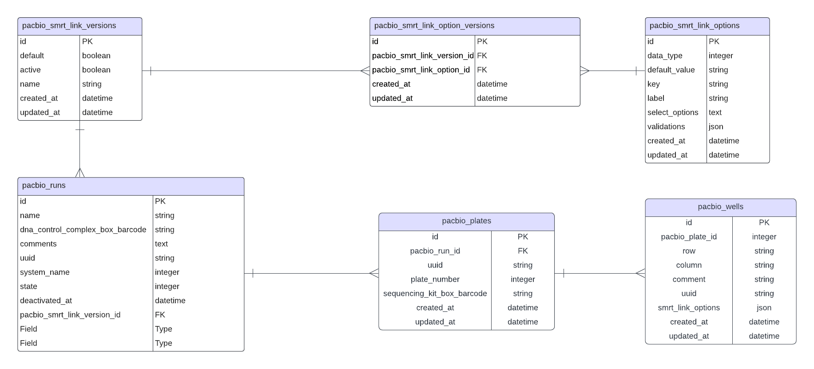
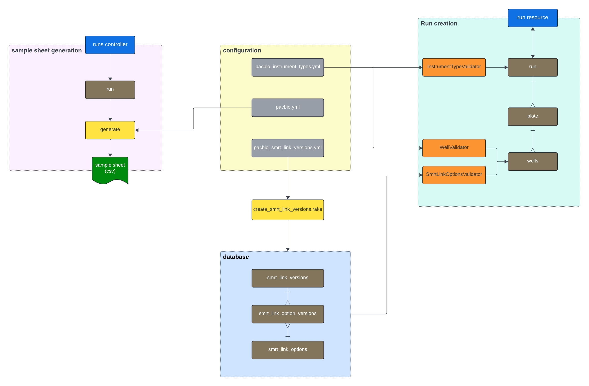

# Architecture

## Entity-Relationship Diagram



## How SMRT Link Versioning works



### Configuration

  1. **Pacbio Instrument Types** - [`config/pacbio_instrument_types.yml`](https://github.com/sanger/traction-service/blob/develop/config/pacbio_instrument_types.yml)

    ```yaml
    revio:
        name: Revio
        smrt_link_versions:
          - v12
        models:
          run:
            root: true
            children: :plates
            validations:
              limits:
                options:
                  attribute: :plates
                  minimum: 1
                  maximum: 2
          plates:
            children: :wells
            validate_each: :plate_number
            validations:
              limits:
                options:
                  exclude_marked_for_destruction: true
                  attribute: :wells
                  minimum: 1
                  maximum: 4
              required_attributes:
                options:
                  required_attributes:
                    - :plate_number
                    - :sequencing_kit_box_barcode
          wells:
            terminator: true
            validations:
              well_positions:
                options:
                  exclude_marked_for_destruction: true
                  valid_positions:
                    - A1
                    - B1
                    - C1
                    - D1
              well_combinations:
                invalid_combinations:
                  - [A1, D1]
                  - [A1, C1]
                  - [B1, D1]
                  - [A1, C1, D1]
                  - [A1, B1, D1]
                  - [D1, B1]
                options:
                  exclude_marked_for_destruction: true
                  valid_combinations:
                    - [A1]
                    - [A1, B1]
                    - [A1, B1, C1]
                    - [A1, B1, C1, D1]
                    - [B1]
                    - [B1, C1]
                    - [B1, C1, D1]
                    - [C1]
                    - [C1, D1]
                    - [D1]
              sequencing_kit_box_barcode:
                options:
                  exclude_marked_for_destruction: true
                  max_number_of_plates: 2
    ```

    - This configuration provides details of instrument type structure and validation.

    - For example for Revio the structure is run > plate > wells:
      - A Revio run can have 1 or 2 plates
      - A revio plate must have a sequencing kit box barcode
      - Revio wells can appear in a number of specific orders

  2. **Pacbio** - [`config/pipelines/pacbio.yml`](https://github.com/sanger/traction-service/blob/develop/config/pipelines/pacbio.yml) - contains details on the sample sheet. When a sample sheet is created this file is used to drive the attributes that will appear, where that data comes from and any class that is used to drive behaviour

  3. **Pacbio SMRT Link Versions** - [`config/pacbio_smrt_link_versions.yml`](https://github.com/sanger/traction-service/blob/develop/config/pacbio_smrt_link_versions.yml) - This file is loaded into the database using a rake task [`lib/tasks/create_smrt_link_versions.rake`](https://github.com/sanger/traction-service/blob/develop/lib/tasks/create_smrt_link_versions.rake). This data is then used in run creation and validation.

### Run Creation

  - When a run is created the SMRT Link version determines how the data will be validated and processed.

  - The system name chosen determines which instrument validation is used, for example if the system is Revio then there must be 1 or 2 plates with 4 wells each.

  - At the run level the validation is done through the [`app/validators/instrument_type_validator.rb`](https://github.com/sanger/traction-service/blob/develop/app/validators/instrument_type_validator.rb`). This retrieves validation options for each instrument type and will validate at the run, plate and well level, for example the well combinations.

  - The main body of validation is done in the wells. The SMRT Link version determines which options must be added. These options are selected in the ui and passed as the smrt_link_options attribute. This is a json field which is a dynamic list thus allowing each well to have a different set of attributes. When a well is validated it uses the [`app/validators/smrt_link_options_validator.rb`](https://github.com/sanger/traction-service/blob/develop/app/validators/smrt_link_options_validator.rb`). This will retrieve the options for the selected SMRT Link version.

### Sample sheet generation

  - The way the sample sheet is generated is also determined by the SMRT Link version.

  - When a request is made to create a sample sheet the pacbio sample_sheet configuration is retrieved.

  - For a Sequel IIe version the attributes, structure and methods to retrieve those attributes are determined in the configuration.

  - For a Revio version the class used to determine the structure of the sample sheet is determined.

  - In the run there is a method `generate_sample_sheet` which will retrieve the sample sheet class, for example  [`app/exchanges/run_csv/pacbio_sample_sheet.rb`](https://github.com/sanger/traction-service/blob/develop/app/exchanges/run_csv/pacbio_sample_sheet.rb`)

  - For certain situations there are additional behaviours determined by the sample sheet behaviour. [`app/models/sample_sheet_behaviour.rb`](https://github.com/sanger/traction-service/blob/develop/app/models/sample_sheet_behaviour.rb`), for example tagging.