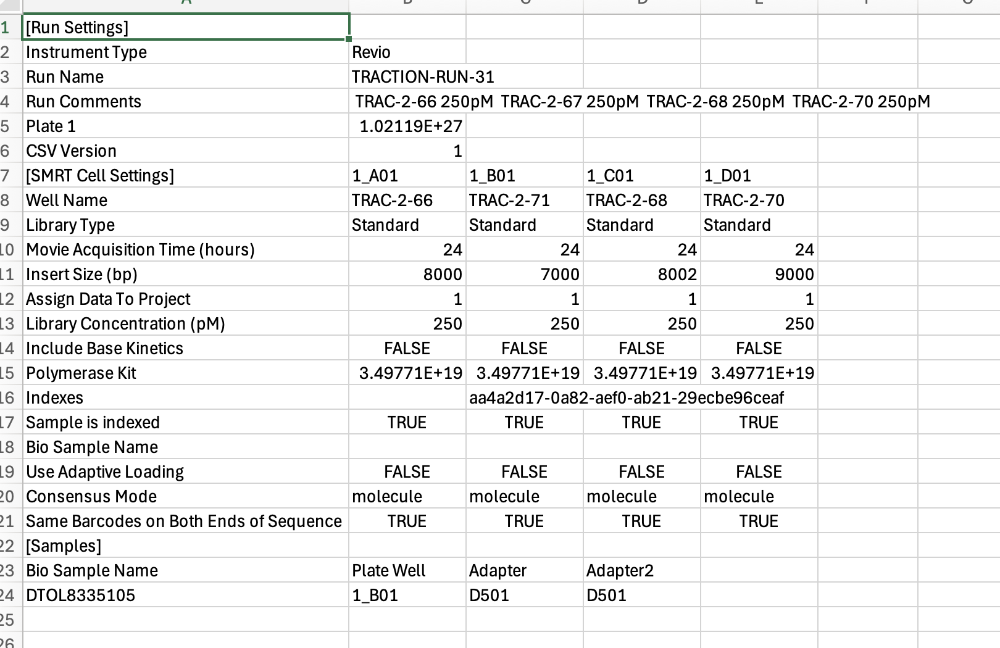

# SMRT Link Versioning

## Overview

[SMRT Link](https://www.pacb.com/smrt-link/) is a set of Pacbio Software tools for Sequel II/IIe and Revio systems designed to set up and monitor long-read HiFi sequencing runs, review performance metrics, analyze, visualize, and annotate sequencing data.

SMRT Link is installed as a server instance. Users upload a sample sheet which relates to a particular run of samples to this instance. They will then start a run using this information on a sequencing machine.

The sample sheet needs to be in a particular format for it to be usable. There are 2 acceptable formats:

- **Old style** - Looks like a traditional spreadsheet but with duplication and quirks

- **New style** - Adheres to a more standard style sample sheet similar to Illumina removing duplication

SMRT Link versions change regularly and users need to be able to use multiple versions at the same time. The release of SMRT Link versions does not include any sort of backwards compatibility.

SMRT Link Versioning is an architecture in Traction (libraries and configuration) to create sample sheets that allows us to support multiple versions of SMRT Link using configuration and limited code changes.

It ensures that users can continue to create sample sheets across several versions with no interuption in service. It also allows the teams who manage the SMRT link instances to swap over and install at their convenience without impacting users.

