# Usage

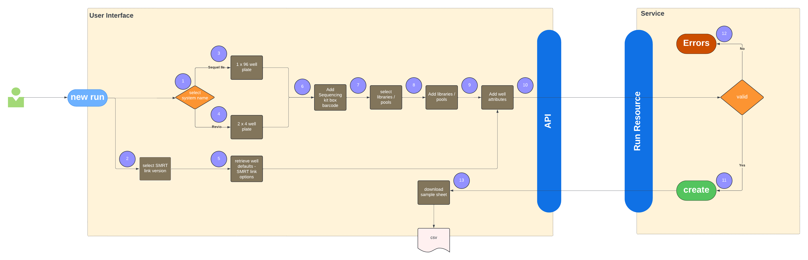

1. **Select System Name**

2. **Select SMRT Link Version**
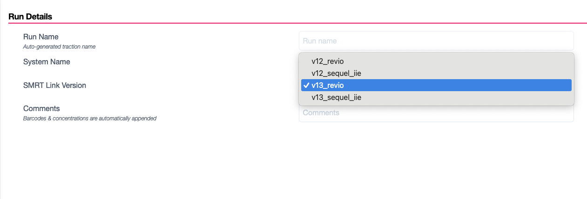
3. **Sequel IIe - 1 x 96 well plate**
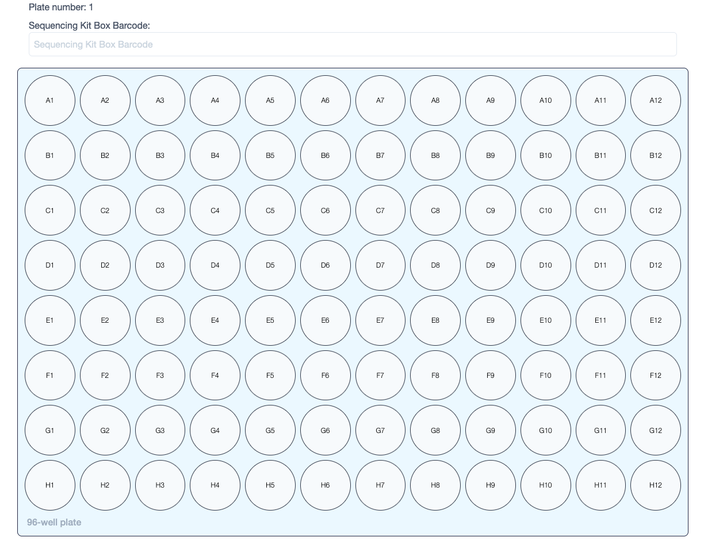
4. **Revio - 2 x 4 well plate**
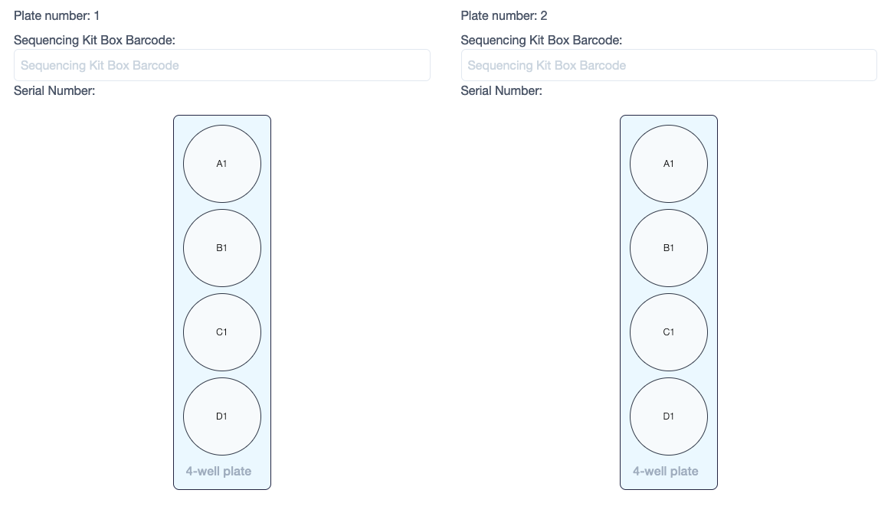
5. **Retrieve well defaults**
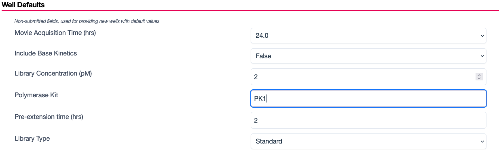
6. **Add Sequencing Kit Box Barcode**
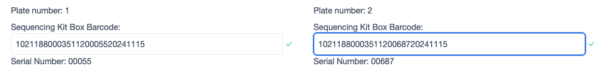
7. **Select pools and libraries**
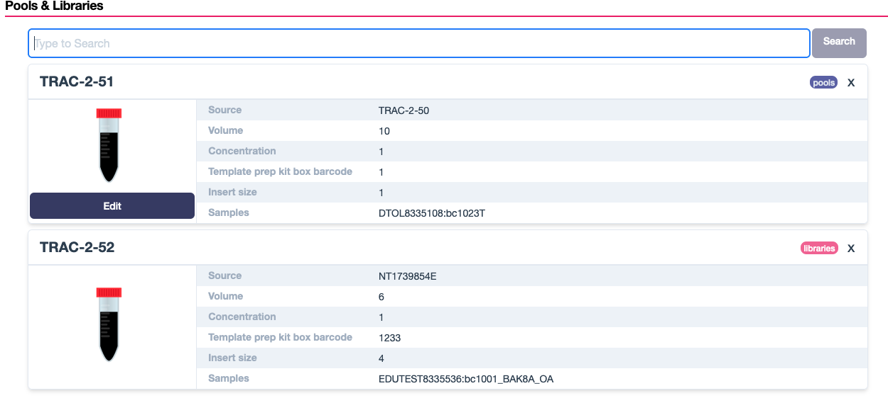
8. **Add pools and libraries**
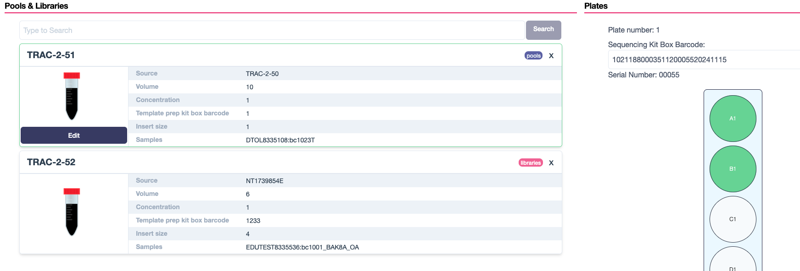
9. **Add well attributes**
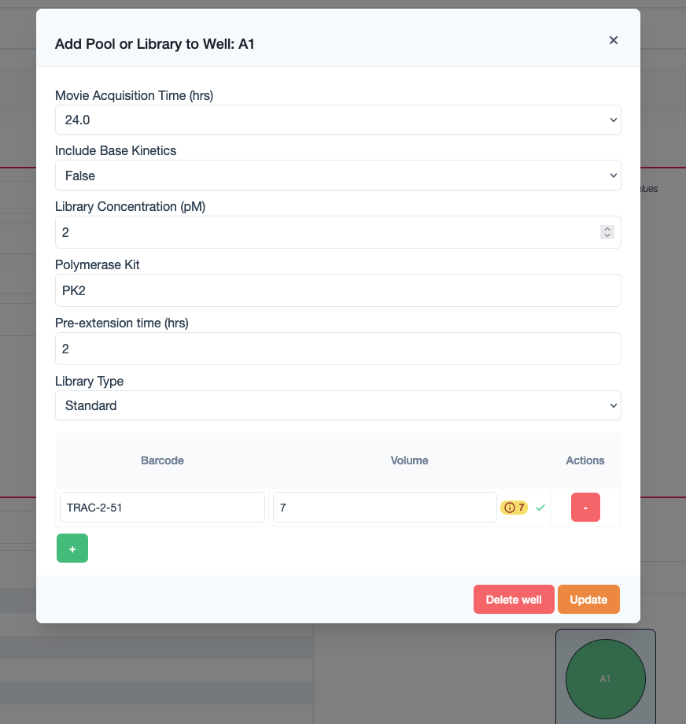
10. **Completed run before create**
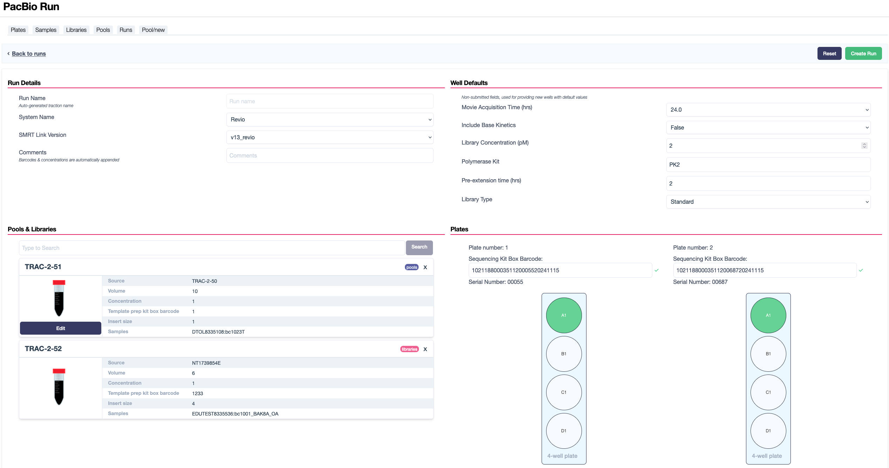
11. **Run successfully created**
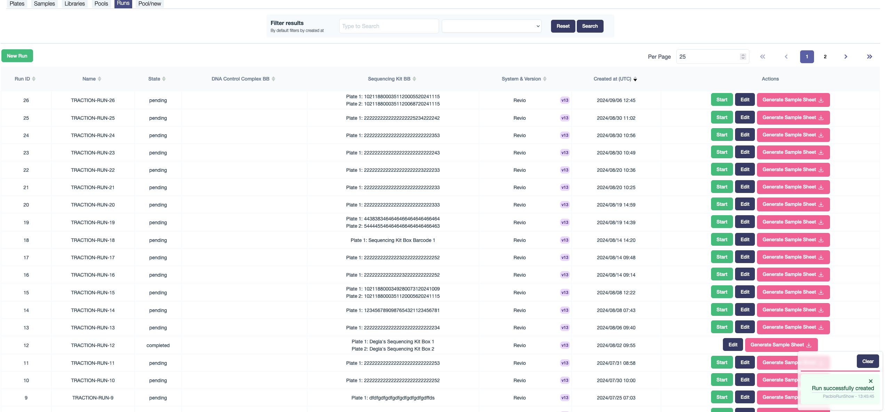
12. **Run not created due to errors**
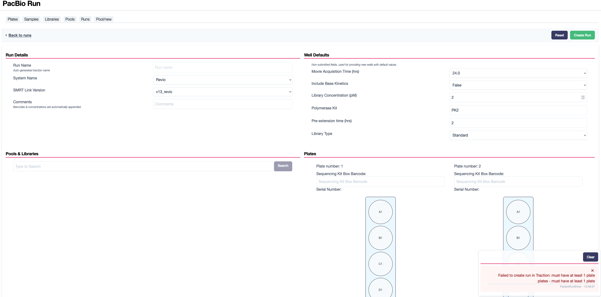
13. **Download Sample Sheet**
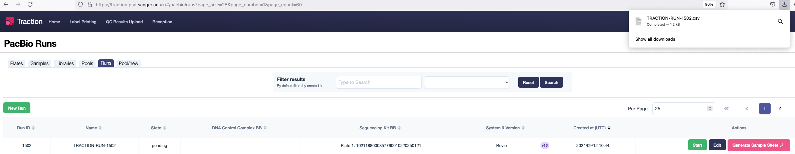
