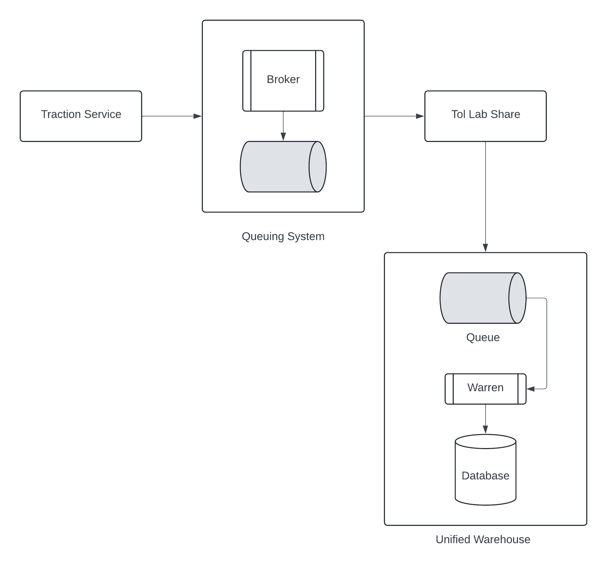
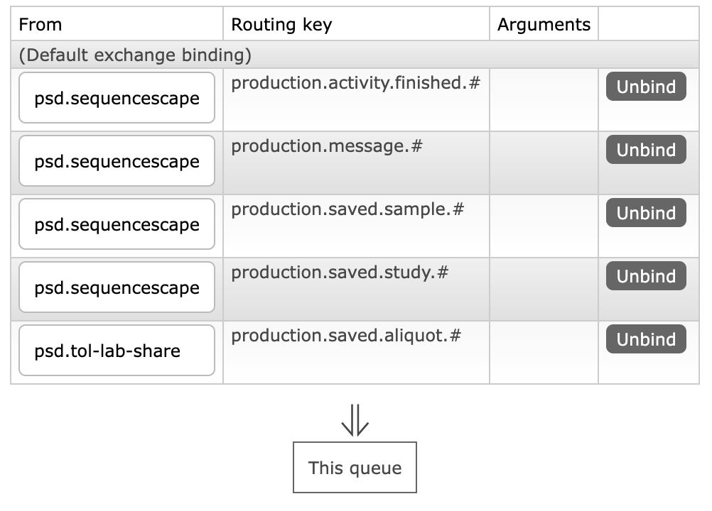
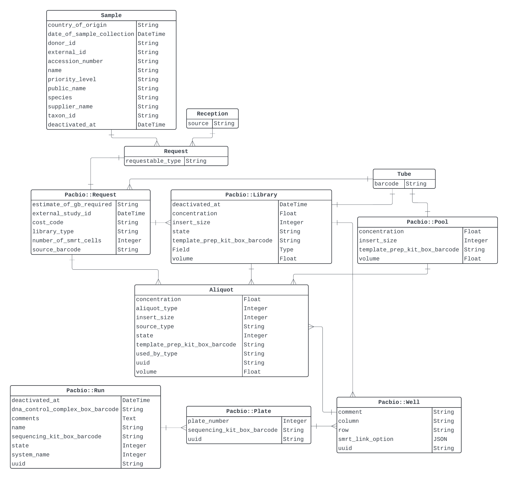

# Architectural Overview

Volume Tracking process is fundamentally an asynchronous process that does not block client threads. Upon the triggers (`run` creation, `library` creation/updates, _etc._), the underlying process runs and reaches an eventual completion persisting the records in MultiLIMS Warehouse.

!!! note

    The asynchrony of the process has been achieved by using an intermediary [RabbitMQ](https://www.rabbitmq.com/docs) queuing system. The queuing system has publishers and  consumers that produce volume tracking messages to the queue, and consume and send to persist the messages respectively. The queuing system is also referred to as the "broker" as it is the broker within the system that manages certain aspects like message delivery.

## Components Involved

- [`traction-service`](https://github.com/sanger/traction-service/): A Ruby-on-Rails application that exposes a REST API for long read LIMS[^1]. This is the primary backend for [Traction](https://traction.psd.sanger.ac.uk/#/dashboard).
- [`tol-lab-share`](https://github.com/sanger/tol-lab-share): This is the consumer application for the queueing system (although might not be the _only_ consumer)[^3].
- MultiLIMS Warehouse[^2]: A relational database that contains warehoused data. The table `aliquot` records volume tracking messages.
- [RedPanda Schema Registry](https://redpanda.psd.sanger.ac.uk/console): A schema registry to store the schemas used in the messaging process.

<figure markdown="span">
  { width="600" }
  <figcaption>Simplified Architecture</figcaption>
</figure>


[^1]: This is one of the "producers" for the queuing system. This is the producer the volume tracking system uses.
[^2]: The data can be viewed either by a LIMS application that connects to the warehouse or a MySQL client.
[^3]: A Python application that does not expose an API. It is mere a consumer that acks (or rejects) messages coming from the queue.

### MultiLIMS Warehouse

The warehouse can either by accessed by traditional SQL connections, or using the setup put forth by [`unified_warehouse`](https://github.com/sanger/unified_warehouse). For volume tracking, we use `unified_warehouse` which itself is a Ruby on Rails project. `unified_warehouse` associates itself with a queue hosted at `ware-uat.sanger.ac.uk`, and another Ruby client `Warren` that shovels messages coming into the associated queue of `unified_warehouse`. 

The messages that needs to be sent to the warehouse database need to be sent to the associated queue `psd.mlwh.multi-lims-warehouse-consumer`  in a specific format, via an exchange that binds to that queue. For volume tracking purposes, a new binding has been created to the queue with the exchange `psd.tol-lab-share`. The routing keys for this queue are as follows:

<figure markdown="span">
  { width="600" }
  <figcaption>Queue Bindings</figcaption>
</figure>

Note that the binding `<environment-name>.saved.aliquot.#` is used for volume tracking.

??? info

    Many of our systems have queues set up for async communication. For example `traction-service` has its own queue for shoveling automated manifest messages to the warehouse queue.

To query aliquots, please use SQL syntax described as follows:

```sql
SELECT <columns> from mlwhwarehouse WHERE <criteria>;
```

Please follow the [Querying](querying-mlwh.md) section for some custom queries for querying the MultiLIMS Warehouse.

### Tol Lab Share

`tol-lab-share` does not have an API exposed to access the application. It is a queue consumer that establishes a set of [AMQP connections](https://www.rabbitmq.com/tutorials/amqp-concepts) with the given queues and consumes messages from them. For each kind of message (for example, volume tracking, bioscan, _etc._), a processor exists to process the incoming messages from the queue. In terms of volume tracking, the processor is located at [`tol_lab_share/processors/create_aliquot_processor.py`](https://github.com/sanger/tol-lab-share/blob/develop/tol_lab_share/processors/create_aliquot_processor.py). The processor does the following:

1. Receives incoming messages from the queue.
2. Validates the incoming message using the schema registry.
3. Synthesises from the contents of the incoming message the aliquot that needs to be created in the warehouse.
4. Creates the message that needs to be sent to the warehouse queue.
5. Publishes the message to the warehouse queue.
6. Log properly each step in the process.

??? info

    All the connection logic, validation and most of connection-specific error handling are encapsulated in the library [`lab-share-lib`](https://github.com/sanger/lab-share-lib). This library is imported to `tol-lab-share`, and activities such as establishing AMQP connections and schema validations are handled by this library.

One of the most important criteria of message processing is handling errors (e.g. erroneous/invalid messages). They are gracefully handled by `tol-lab-share`.

!!! question

    What would happen if the message processing fails?

    Eventual failures are [dead-lettered](https://www.rabbitmq.com/docs/dlx). There is a setup for dead letter exchanges (dlx) and the queues that are bound to those exchanges (dlq) that are persistent. Messages that were dead lettered can be retrieved from these queues and investigated.

As explained in [a previous](#components-involved) section, `tol-lab-share` publishes messages to the warehouse queue. This is done by using the associated queue and the related configurations discussed in previous sections. The overall sequence and detailed error mitigation procedures involving `tol-lab-share` is embedded below (to open it in Lucid chart you might need specific access).

<div style="width: 750px; height: 720px; margin: 10px; position: relative;"><iframe allowfullscreen frameborder="0" style="width:750px; height:720px" src="https://lucid.app/documents/embedded/6c8d5b09-4e57-4aba-a7ff-8d2cad161b3d" id="D-m4E_KjbZS8"></iframe></div>

### Traction Service

The entities laid out for volume tracking in `traction-service` are given below:

<figure markdown="span">
  
  <figcaption>Entities used for Volume Tracking in Traction</figcaption>
</figure>

Note that this **does not** display all the entities used in `traction-service`. It displays only the important entities used for volume tracking and the relationships between them.
