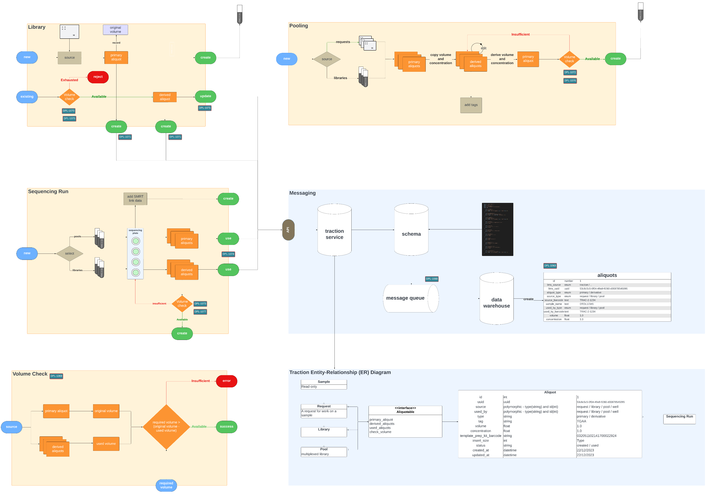
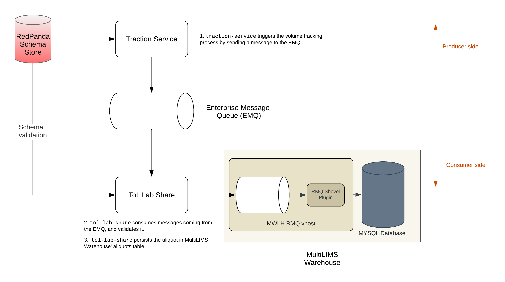

# Volume Tracking

Excepteur nulla officia aliquip velit eiusmod incididunt esse ea Lorem. Duis irure anim ea tempor nostrud fugiat ad. Quis et ullamco anim velit est ea ad dolore magna adipisicing proident. Deserunt est aliqua nulla veniam consequat magna do cupidatat. Laborum in incididunt consequat eiusmod commodo eiusmod ea duis aliquip mollit in. Dolor occaecat velit ea ipsum eiusmod Lorem amet laborum deserunt commodo non occaecat in commodo. Proident culpa sit consectetur ut aliqua cupidatat consectetur voluptate anim. Pariatur excepteur consequat duis culpa elit est qui sint ipsum mollit ipsum elit. Adipisicing magna velit nulla cillum adipisicing fugiat. Tempor id veniam eu non ipsum ut elit pariatur quis tempor. Non ex culpa est esse labore. Ipsum adipisicing exercitation laborum do excepteur id tempor ipsum ullamco do commodo nostrud amet. Elit velit sit nisi dolor eu laboris qui nisi et aliqua pariatur.

Do ad irure sunt eu Lorem nulla sint dolor. Cillum deserunt ex reprehenderit aliquip nisi. Voluptate consequat nostrud labore voluptate exercitation proident proident excepteur est deserunt anim dolor culpa. Eiusmod enim nulla magna adipisicing amet aliqua dolore duis laborum duis eu eu cupidatat.

Pariatur ex ipsum duis elit eiusmod culpa excepteur cillum ut. Nulla voluptate irure enim nulla est enim ex. Non ullamco proident laboris ipsum eu Lorem mollit.

## Procedural Overview

The overall procedure for volume tracking is displayed below.

## Architectural Overiew

The overall architecture for volume tracking is displayed below.

