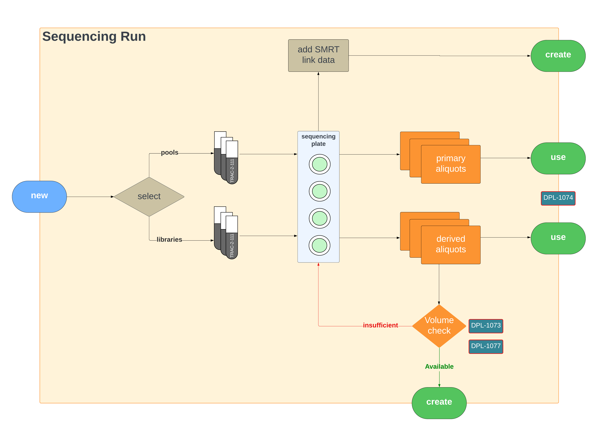

# Process flow of Volume Tracking

In a nutshell, Volume Tracking is the process of tracking down volume of each aliquot created from the sample, and discern whether there is enough sample volume available for further sequencing. Therefore, we need to track and record the initial volume of the sample, and the volume of each aliquot created from the corresponding sample. Consider the diagram below.

!!! info

    We record the ^^initial volume^^ of a sample in these scenarios:

    1. Creating a library
    2. Creating a pool

    When we are using a library or a pool in a run, we are recording the ^^used volume^^ of each library or pool in a run, as well as the libraries that are used in a pool within a run.

As mentioned above, the entire volume tracking process depends on the following concept:

$$
V_{required} < V_{original} - V_{used}
$$

The volume checking process involves primary aliquots that record the original volume of a library/pool or a run, and the summation of all the derived aliquots that are required. If the required volume is higher than the available volume, the volume check fails.

## Libraries

Assume that a library is created with a volume and concentration. The system then records this event by persisting a record in `aliquot` table with `aliquot_type` equal to `primary` and `source_type` equal to `library` along with the volume and concentration.

The process diagram for the above use-case is depicted below.

## Pools

When creating a pool, a primary aliquot is created with `source_type` equal to `PacBio::Pool`. A Pool can be created using multiple libraries as well multiple requests. Derived aliquots are created for each library or request used in a pool. But we are only sending aliquots created by the library (we are not sending aliquots created by the request) to the warehouse. 

<figure markdown="span">
  
  <figcaption>Pool creation with samples</figcaption>
</figure>

=== "Used volume of the pool"

    !!! note
    
        We are displaying the used volume of the pool as a badge (as shown in the figure below) and if the user enters a value less than the already-used volume an error prompt displayed in the page and the user would not be allowed to create/update the pool.

    <figure markdown="span">
      
      <figcaption>Pool creation with samples</figcaption>
    </figure>

=== "Available volume of libraries in the pool"

    !!! note

        We are displaying the available volume of each library, if the user enters a value higher than the available volume there would an error prompt displayed in the page and the user would not be allowed to create/update the pool.

    <figure markdown="span">
      
      <figcaption>Pool creation with samples</figcaption>
    </figure>

The process diagram for the above use-case is depicted below.

## Run

When creating a run, a primary aliquot is created with `source_type` as `Pacbio::Well` and a well can be created using multiple libraries as well as using multiple pools. Derived aliquots are created for each library or pool used in a run. We are publishing the following aliquots into the warehouse as part of run creation process:

1. Derived aliquot for each library used in the run.
2. Derived aliquot for each pool used in the run.
3. Derived aliquot for each library used in a pool for the run

We are displaying the available volume of each library, if the user enters a value higher than the available volume there would an error prompt displayed in the page and the user would not be allowed to create/update the run.

The process diagram for the above use-case is depicted below.

---

The LucidChard Process Diagram for the end-to-end process is embedded below.

<iframe allowfullscreen frameborder="0" style="width:960px; height:720px" src="https://lucid.app/documents/embedded/3c12fbb3-5265-49b5-9f6a-97c9a69a59eb" id="J~04Hgj-wY2C"></iframe>
