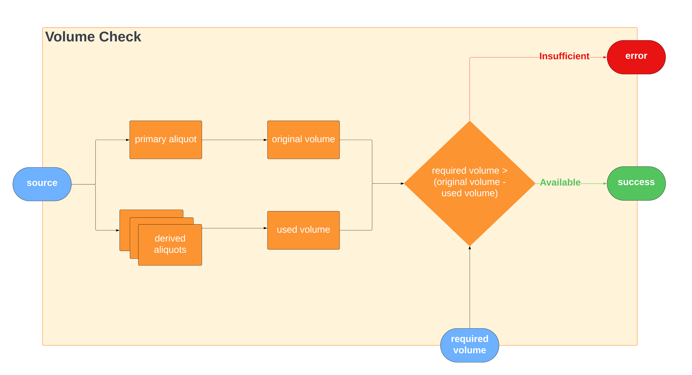
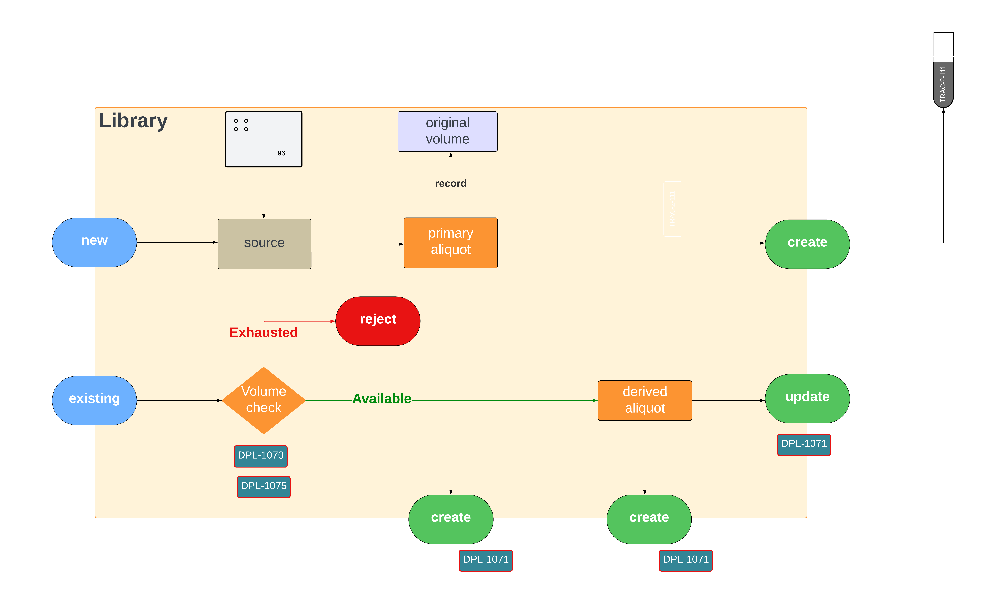
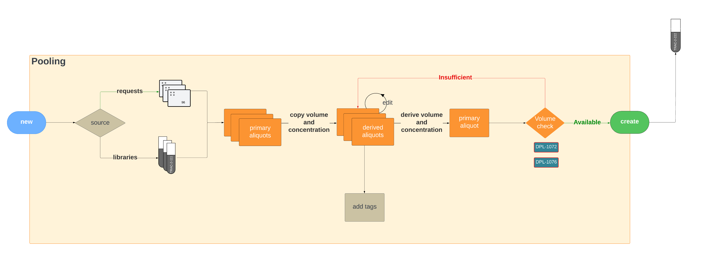

# Process flow of Volume Tracking

In a nutshell, Volume Tracking is the process of tracking down volume of each aliquot created from the sample, and discern whether there is enough sample volume available for further sequencing. Therefore, we need to track and record the initial volume of the sample, and the volume of each aliquot created from the corresponding sample. Consider the diagram below.

As mentioned above, the entire volume tracking process depends on the following concept:

$$
V_{required} > V_{original} - V_{used}
$$

The volume checking process involves primary aliquots that record the original volume of a library/pool or a run, and the summation of all the derived aliquots that are required. If the required volume is higher than the available volume, the volume check fails.

## Libraries and Runs

Assume that a library is created with a volume $V_{0}$ and concentration $C_{0}$. The system then records this event by persisting a record in `aliquot` table with `aliquot_type` equal to `primary` and `source_type` equal to `library` along with the volume ($V_{0}$) and concentration ($C_{0}$). A similar record is persisted in `aliquot` table with `aliquot_type` equal to `derived` with the exact same volume and concentration but with `source_type` equal to `PacBio::Request` and `used_by_type` equal to `Pacbio::Library`. 

!!! note

    If and when the library volume is updated to $V_{1}$, a volume tracking message is triggered and a new `primary_aliquot` record is persisted in the warehouse with the new volume $V_{1}$ and concentration.

When a run (or a pool) is created from an existing library, a derived aliquot is created following a volume check. In this example, the primary aliquot created for the library has a volume $V_{0} = 60$ and the **derived aliquot** created **for the run** will have a volume $30$ with the `source_type` equal to `Pacbio::Library` and `used_by_type` equal to `Pacbio::Well`.

!!! note

    Note the yellow color indication with $60$ next to the Volume of the dialog above. It displays the available volume of the library to be used for the run. 

The process diagram for the above use-case is depicted below.

## Pools

When creating a pool from a library, a primary aliquot is created with `source_type` equal to `PacBio::Pool`. Derived aliquots are created for each pooled sample.

<figure markdown="span">
  
  <figcaption>Pool creation with samples</figcaption>
</figure>

Note that each pooled sample displays the available volume next to the "Volume" column in the form.

The LucidChard Process Diagram is embedded below.

<iframe allowfullscreen frameborder="0" style="width:960px; height:720px" src="https://lucid.app/documents/embedded/3c12fbb3-5265-49b5-9f6a-97c9a69a59eb" id="J~04Hgj-wY2C"></iframe>
