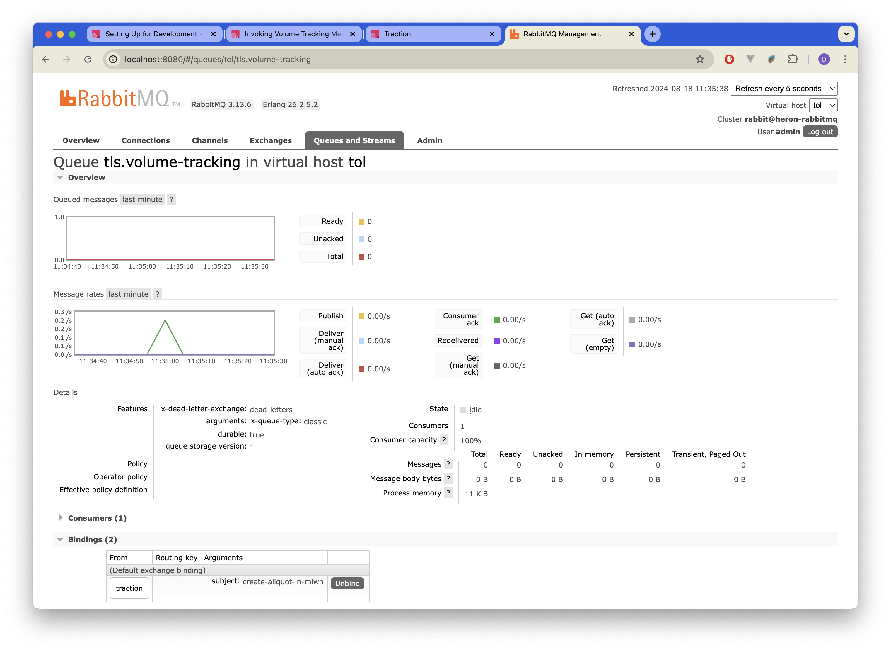
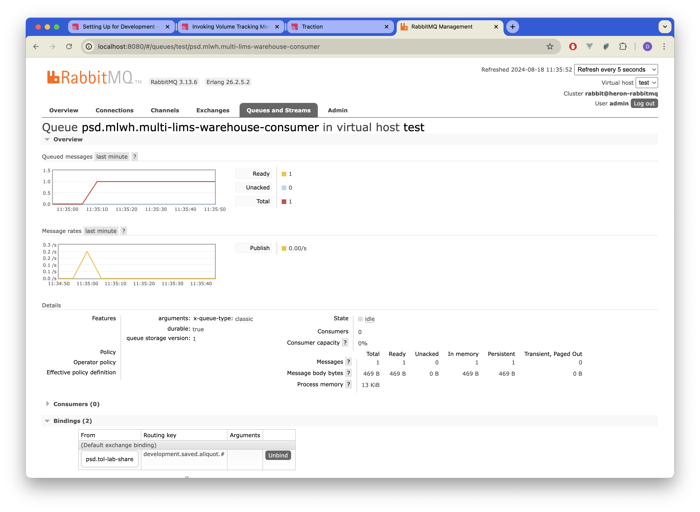

# Invoking Volume Tracking messages through Traction Service

There are multiple ways the volume tracking message can be triggered. In this instance, we will use `traction-service` without using the UI of Traction. How the users trigger this would be using Traction UI, and it is documented elsewhere. We will use Rails' [REPL console](https://guides.rubyonrails.org/command_line.html#bin-rails-console) to trigger a message into the warehouse.

!!! warning "Read this before running through this section"

    This section assumes that you have already went through the setting up process that was explained in a section before. You will not need a running `traction-service` instance but you will need a running `tol-lab-share` instance.

First, we need to enter into the Rails console. This can be done by the following command in `traction-service` directory.

```bash
bundle exec rails c
```

This will give an interactive Rails console where you can invoke Rails sytnax.

Next, we will trigger the volume tracking process. This involves a series of Ruby expressions.

```ruby linenums="1"
library = Pacbio::Library.first
pool = Pacbio::Pool.first

aliquot = Aliquot.new(uuid:SecureRandom.uuid, volume:10,concentration:2.5,template_prep_kit_box_barcode: "AB123456",source:library,used_by:pool, aliquot_type:'derived',created_at:Time.now, insert_size: 100)

Emq::Publisher.publish(aliquot,Pipelines.pacbio,'volume_tracking')
```

This should produce the results as the console outputs and screenshots attached below.

???+ tip
    You can paste (using ++cmd+v++ ) the code fragment displayed above in the Rails console and press ++enter++ to publish volume tracking messages.


=== "Rails Console Output"

    ```bash
    [1] pry(main)> library = Pacbio::Library.first
    pool = Pacbio::Pool.first

    aliquot = Aliquot.new(uuid:SecureRandom.uuid, volume:10,concentration:2.5,template_prep_kit_box_barcode: "AB123456",source:library,used_by:pool, aliquot_type:'derived',created_at:Time.now, insert_size: 100)
    [1] pry(main)> library = Pacbio::Library.first
    pool = Pacbio::Pool.firstiquot,Pipelines.pacbio,'volume_tracking')
    aliquot = Aliquot.new(uuid:SecureRandom.uuid, volume:10,concentration:2.5,template_prep_kit_box_barcode: "AB123456",source:library,used_by:pool, aliquot_type:'derived',created_at:Time.now, insert_size: 100)
    Emq::Publisher.publish(aliquot,Pipelines.pacbio,'volume_tracking')

    Pacbio::Library Load (0.6ms)  SELECT `pacbio_libraries`.* FROM `pacbio_libraries` ORDER BY `pacbio_libraries`.`id` ASC LIMIT 1
    Pacbio::Pool Load (0.4ms)  SELECT `pacbio_pools`.* FROM `pacbio_pools` ORDER BY `pacbio_pools`.`id` ASC LIMIT 1
    DEPRECATION WARNING: Defining enums with keyword arguments is deprecated and will be removed
    in Rails 8.0. Positional arguments should be used instead:

    enum :state, {:created=>0, :used=>1}
    (called from <class:Aliquot> at /Users/dp27/Documents/Projects/traction-service/app/models/aliquot.rb:10)
    DEPRECATION WARNING: Defining enums with keyword arguments is deprecated and will be removed
    in Rails 8.0. Positional arguments should be used instead:

    enum :aliquot_type, {:primary=>0, :derived=>1}
    (called from <class:Aliquot> at /Users/dp27/Documents/Projects/traction-service/app/models/aliquot.rb:11)
    Tube Load (0.5ms)  SELECT `tubes`.* FROM `tubes` WHERE `tubes`.`id` = 1 LIMIT 1
    Pacbio::Request Load (0.9ms)  SELECT `pacbio_requests`.* FROM `pacbio_requests` WHERE `pacbio_requests`.`id` = 1 LIMIT 1
    DEPRECATION WARNING: Defining enums with keyword arguments is deprecated and will be removed
    in Rails 8.0. Positional arguments should be used instead:

    enum :retention_instruction, {:destroy_after_2_years=>0, :return_to_customer_after_2_years=>1, :long_term_storage=>2}
    (called from <class:Sample> at /Users/dp27/Documents/Projects/traction-service/app/models/sample.rb:9)
    Sample Load (1.5ms)  SELECT `samples`.* FROM `samples` INNER JOIN `requests` ON `samples`.`id` = `requests`.`sample_id` WHERE `requests`.`requestable_id` = 1 AND `requests`.`requestable_type` = 'Pacbio::Request' LIMIT 1
    Using cached schema for create-aliquot-in-mlwh v1
    Published volume tracking message to EMQ
    => true
    ```

=== "Tol Lab Share Console Output"

    ```bash
    2024-08-18 11:35:00,290 rabbit_messages                              :271 INFO    Received message # 1 with body:  b'\xc3\x01.\xa3Vl\x13\x82\x81\x9dHf8449d34-93d8-4dd1-89e3-17f8ee9b6ef8\xe4\xe3\xef\xd0\xacd\x10TractionH6538ddbe-25e2-46e7-887e-bfc4227fa607\x02\x04\x10TRAC-2-1BsangerId-TOLTESTING-PLATE-1-1-0-1\x06\x00\x00\x00 A\x02\x00\x00 @\x02\xc8\x01\xa6\xe3\xef\xd0\xacd'
    2024-08-18 11:35:00,309 rabbit_messages                              :45  INFO    Decoded binary message body:
    [{'messageUuid': UUID('f8449d34-93d8-4dd1-89e3-17f8ee9b6ef8'), 'messageCreateDateUtc': datetime.datetime(2024, 8, 18, 10, 35, 0, 210000, tzinfo=datetime.timezone.utc), 'limsId': 'Traction', 'aliquotUuid': UUID('6538ddbe-25e2-46e7-887e-bfc4227fa607'), 'aliquotType': 'derived', 'sourceType': 'library', 'sourceBarcode': 'TRAC-2-1', 'sampleName': 'sangerId-TOLTESTING-PLATE-1-1-0-1', 'usedByType': 'none', 'usedByBarcode': '', 'volume': 10.0, 'concentration': 2.5, 'insertSize': 100, 'recordedAt': datetime.datetime(2024, 8, 18, 10, 35, 0, 179000, tzinfo=datetime.timezone.utc)}]
    2024-08-18 11:35:00,310 tol_lab_share.processors.create_aliquot_processor:47  INFO    Message received: <lab_share_lib.processing.rabbit_message.RabbitMessage object at 0x100b6f250>
    2024-08-18 11:35:00,310 tol_lab_share.messages.mlwh.create_aliquot_message:115 INFO    Sending json to the warehouse queue: {"lims": "Traction", "aliquot": {"id_lims": "Traction", "aliquot_uuid": "6538ddbe-25e2-46e7-887e-bfc4227fa607", "aliquot_type": "derived", "source_type": "library", "source_barcode": "TRAC-2-1", "sample_name": "sangerId-TOLTESTING-PLATE-1-1-0-1", "used_by_type": "none", "used_by_barcode": "", "volume": 10.0, "concentration": 2.5, "insert_size": 100, "last_updated": "2024-08-18T10:35:00Z", "recorded_at": "2024-08-18T10:35:00Z", "created_at": "2024-08-18T10:35:00Z"}}
    2024-08-18 11:35:00,310 lab_share_lib.rabbit.basic_publisher         :73  INFO    Publishing message to exchange 'psd.tol-lab-share', routing key 'development.saved.aliquot', schema subject 'None', schema version 'None'.
    2024-08-18 11:35:00,310 rabbit_messages                              :77  INFO    Published message body:  {"lims": "Traction", "aliquot": {"id_lims": "Traction", "aliquot_uuid": "6538ddbe-25e2-46e7-887e-bfc4227fa607", "aliquot_type": "derived", "source_type": "library", "source_barcode": "TRAC-2-1", "sample_name": "sangerId-TOLTESTING-PLATE-1-1-0-1", "used_by_type": "none", "used_by_barcode": "", "volume": 10.0, "concentration": 2.5, "insert_size": 100, "last_updated": "2024-08-18T10:35:00Z", "recorded_at": "2024-08-18T10:35:00Z", "created_at": "2024-08-18T10:35:00Z"}}
    2024-08-18 11:35:00,322 lab_share_lib.rabbit.basic_publisher         :117 INFO    The message was published to RabbitMQ successfully.
    2024-08-18 11:35:00,323 tol_lab_share.processors.create_aliquot_processor:63  INFO    Message processing completed.
    2024-08-18 11:35:00,323 lab_share_lib.rabbit.async_consumer          :281 INFO    Acknowledging message # 1
    ```

=== "Volume Tracking Queue"

    

=== "MLWH Warehouse Queue"

    

!!! success "Why does the warehouse queue have one message remaining?"

    We have not configured a `unified_warehouse` instance to consume the message coming into the warehouse queue (i.e. `psd.mlwh.multi-lims-warehouse-consumer`). If we had, this message would have been consumed and persisted in the database.