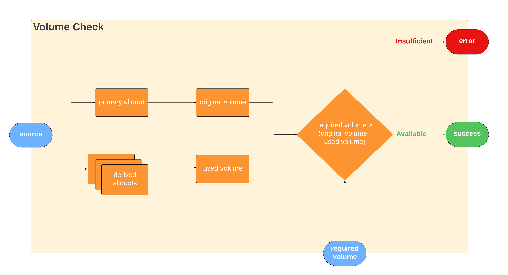
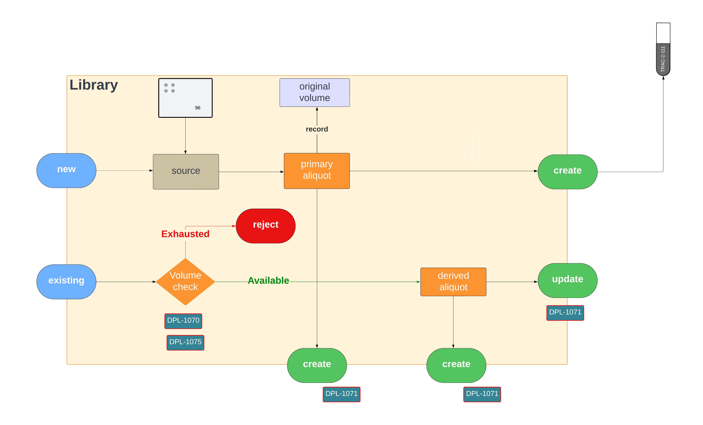
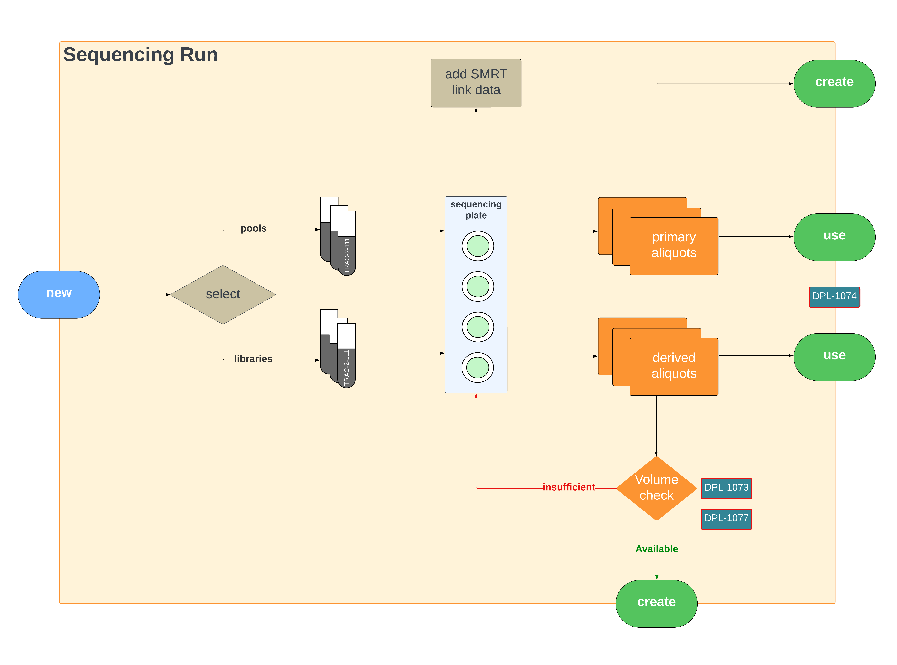

# Process flow of Volume Tracking

In a nutshell, Volume Tracking is the process of tracking down volume of each aliquot created from the sample, and discern whether there is enough sample volume available for further sequencing. Therefore, a requirement arise to track and record the initial volume of the sample, and the volume of each aliquot created from the corresponding sample. Consider the diagram below.

As mentioned above, the entire volume tracking process depends on the following concept:

$$
V_{required} > V_{original} - V_{used}
$$

When a new library is created from a sample, the system developed for volume tracking in Traction creates a model pertaining to the concept of **primary aliquot**, and records its original volume. And when the library is used for sequencing runs, a volume check is performed and if passed (i.e., sufficient volume is available) a **derived aliquot** is created. 

When pooling, the volume and concentration of each primary aliquot is copied as a derived aliquot. These aliquots undergo an additional step where the volume and concentration are derived, adjusting for the needs of the pooling. A volume check is performed after the derivation process with the primary aliquots to check availability.

Upon creating a sequencing run, pools or libraries are transferred into the sequencing plate. The run may use primary and derived aliquots for the sequencing process. If volume is not enough to create the derived aliquot, the volume check fails.

!!! note

    Every time a primary and/or a derived aliquot is created and/or updated, `traction-service` triggers a message to the message broker which eventually delivers the message (through `tol-lab-share`) to MultiLIMS Warehouse. This is how tracking of volume is achieved through the system.

The LucidChard Process Diagram is embedded below.

<iframe allowfullscreen frameborder="0" style="width:960px; height:720px" src="https://lucid.app/documents/embedded/3c12fbb3-5265-49b5-9f6a-97c9a69a59eb" id="J~04Hgj-wY2C"></iframe>
