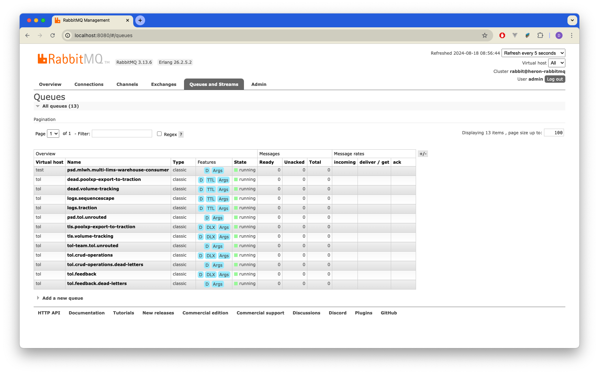

# Setting up for Development

This section discusses setting up the volume tracking stack for local development. 
Setting up the end-to-end process involves several tools and technologies and therefore setting up involves spinning up [Docker](https://www.docker.com/) containers along with the application(s). 
Using containers helps the process to run the entire infrastructure stack in the development machine and makes setting up quite easy with ready-made scripts and manifests.

## Overview

Setting up the volume tracking stack involves running the following applications.

1. `tol-lab-share`
2. `traction-service`

The third component used, as described in other sections, is MultiLIMS Warehouse. 
It could be set up locally, but since we could easily use the UAT instance of the warehouse, this document does not aim to discuss setting up a local warehouse instance. 
If required, it is possible to set up the warehouse by running a local instance of `unified_warehouse` which is documented in its [repository README](https://github.com/sanger/unified_warehouse).

???+ info

    At the time of this writing, there are only two running instances of MultiLIMS Warehouse. These instances are in following environments.

    1. UAT/Training: The broker is accessible through the management portal UI. The URI is of the format `https://<warehouse host name>:<management UI port>`.
    2. Production: The broker is accessible through the [management portal UI](http://ware-prod.psd.sanger.ac.uk:15672/#/).

    Each environment is therefore equipped with its own message broker, a management portal (to the broker), and a MySQL database to hold the data. 
    As per our current configurations, the applications deployed to respective environments are pointing to the warehouses in the following manner:

    - UAT Application Environment → UAT MLWH Environment
    - Training Application Environment → UAT MLWH Environment
    - Production Application Environment → Production MLWH Environment

## Prerequisites

1. **Ruby** (version specified in [`.ruby-version`](https://github.com/sanger/traction-service/blob/develop/.ruby-version)): Ruby is required to run Traction.
2. **Python** (version specified in [`Pipfile`](https://github.com/sanger/tol-lab-share/blob/develop/Pipfile)) and [Pipenv](https://pipenv.pypa.io/en/latest/): Python is required to run `tol-lab-share`.
3. **Docker Engine** (installation guide can be found [here](https://docs.docker.com/engine/install/)): Docker is required to set up the underlying infrastructure locally.
4. **rbenv**: Setup guide [here](https://github.com/rbenv/rbenv).
5. **MySQL**: Setup guide [here](https://github.com/sanger/developer-laptop-setup/blob/main/laptop_setup.md#mysql).
6. **`jq` CLI**: Setup guide [here](https://formulae.brew.sh/formula/jq).

## Setting Up

The sections below give instructions to set up and run the components related to volume tracking use-cases.

### Setting up the infrastructure locally

1. Clone the [repository](https://github.com/sanger/tol-lab-share) from GitHub.
2. Use docker to set the underlying infrastructure:

    ```bash
    ./docker/dependencies/up.sh
    ./schemas/push.sh http://localhost:8081
    ```

    The first command sets up the infrastructure and the second pushes the schemas in the `schemas` directory to the local RedPanda instance hosted at `http://localhost:8081`.

3. Set up the queueing infrastructure with the following command.

    ```bash
    python setup_dev_rabbit.py
    ```

4. Create a `.env` file in the root directory of `tol-lab-share`, and add the following contents:

    ```env
    WAREHOUSE_RMQ_HOST=127.0.0.1
    WAREHOUSE_RMQ_USER=admin
    WAREHOUSE_RMQ_PASSWORD=development
    ```

!!! tip

    You should be able to access the management portal with `http://localhost:8080/#/queues` with username `admin` and password `development`.

    <figure markdown="span">
      { width="800" }
      <figcaption>Local RabbitMQ Management Portal</figcaption>
    </figure>

### Setting up `tol-lab-share`

Make sure you've set up the infrastructure locally before proceeding with this step.

1. Clone the [repository](https://github.com/sanger/tol-lab-share) from GitHub.
2. Use pipenv to install the required python packages for the application and development:

    ```shell
    pipenv install --dev
    ```

3. Run `tol-lab-share` with the following command:

    ```bash
    pipenv run python main.py
    ```

    It should display that `tol-lab-share` is listening to AMQP connections.

    ```shell
    > pipenv run python main.py
    Loading .env environment variables...
    Starting TOL consumer
    2024-08-18 08:51:52,215 lab_share_lib.rabbit.async_consumer          :84  INFO    Connecting to 127.0.0.1
    2024-08-18 08:51:52,215 lab_share_lib.rabbit.async_consumer          :84  INFO    Connecting to 127.0.0.1
    2024-08-18 08:51:52,215 lab_share_lib.rabbit.async_consumer          :84  INFO    Connecting to 127.0.0.1
    2024-08-18 08:51:52,228 lab_share_lib.rabbit.async_consumer          :118 INFO    Connection opened
    2024-08-18 08:51:52,228 lab_share_lib.rabbit.async_consumer          :163 INFO    Creating a new channel
    2024-08-18 08:51:52,228 lab_share_lib.rabbit.async_consumer          :118 INFO    Connection opened
    2024-08-18 08:51:52,228 lab_share_lib.rabbit.async_consumer          :163 INFO    Creating a new channel
    2024-08-18 08:51:52,228 lab_share_lib.rabbit.async_consumer          :118 INFO    Connection opened
    2024-08-18 08:51:52,228 lab_share_lib.rabbit.async_consumer          :163 INFO    Creating a new channel
    2024-08-18 08:51:52,229 lab_share_lib.rabbit.async_consumer          :174 INFO    Channel opened
    2024-08-18 08:51:52,229 lab_share_lib.rabbit.async_consumer          :184 INFO    Adding channel close callback
    2024-08-18 08:51:52,229 lab_share_lib.rabbit.async_consumer          :174 INFO    Channel opened
    2024-08-18 08:51:52,229 lab_share_lib.rabbit.async_consumer          :184 INFO    Adding channel close callback
    2024-08-18 08:51:52,229 lab_share_lib.rabbit.async_consumer          :174 INFO    Channel opened
    2024-08-18 08:51:52,229 lab_share_lib.rabbit.async_consumer          :184 INFO    Adding channel close callback
    2024-08-18 08:51:52,229 lab_share_lib.rabbit.async_consumer          :216 INFO    QOS set to: 1
    2024-08-18 08:51:52,229 lab_share_lib.rabbit.async_consumer          :229 INFO    Issuing consumer related RPC commands
    2024-08-18 08:51:52,229 lab_share_lib.rabbit.async_consumer          :244 INFO    Adding consumer cancellation callback
    2024-08-18 08:51:52,229 lab_share_lib.rabbit.async_consumer          :216 INFO    QOS set to: 1
    2024-08-18 08:51:52,229 lab_share_lib.rabbit.async_consumer          :229 INFO    Issuing consumer related RPC commands
    2024-08-18 08:51:52,229 lab_share_lib.rabbit.async_consumer          :244 INFO    Adding consumer cancellation callback
    2024-08-18 08:51:52,230 lab_share_lib.rabbit.async_consumer          :216 INFO    QOS set to: 1
    2024-08-18 08:51:52,230 lab_share_lib.rabbit.async_consumer          :229 INFO    Issuing consumer related RPC commands
    2024-08-18 08:51:52,230 lab_share_lib.rabbit.async_consumer          :244 INFO    Adding consumer cancellation callback
    ```

???+ info

    Note that the consumer (i.e., `tol-lab-share`) has established _three_ connections with the RabbitMQ broker (and three channels). These connections are as follows:

    1. `TOL_RABBIT_SERVER`
    2. `ISG_RABBIT_SERVER`

    (Connection details can be found in [`tol_lab_share/config/rabbit.py`](https://github.com/sanger/tol-lab-share/blob/develop/tol_lab_share/config/rabbit.py) file)

    The third connection is also with `ISG_RABBIT_SERVER` itself.

    ```py title="Rabbit Servers"
    RABBITMQ_SERVERS = [
        RabbitConfig(
            consumer_details=TOL_RABBIT_SERVER,
            consumed_queue="tol.crud-operations",
            message_subjects={
                RABBITMQ_SUBJECT_CREATE_LABWARE: MessageSubjectConfig(
                    processor=CreateLabwareProcessor, reader_schema_version="2"
                ),
                RABBITMQ_SUBJECT_UPDATE_LABWARE: MessageSubjectConfig(
                    processor=UpdateLabwareProcessor, reader_schema_version="1"
                ),
            },
            publisher_details=TOL_RABBIT_SERVER,
        ),
        RabbitConfig(
            consumer_details=ISG_RABBIT_SERVER,
            consumed_queue="tls.poolxp-export-to-traction",
            message_subjects={
                RABBITMQ_SUBJECT_BIOSCAN_POOL_XP_TO_TRACTION: MessageSubjectConfig(
                    processor=BioscanPoolXpToTractionProcessor, reader_schema_version="1"
                ),
            },
            publisher_details=ISG_RABBIT_SERVER,
        ),
        RabbitConfig(
            consumer_details=ISG_RABBIT_SERVER,
            consumed_queue="tls.volume-tracking",
            message_subjects={
                RABBITMQ_SUBJECT_CREATE_ALIQUOT_IN_MLWH: MessageSubjectConfig(
                    processor=CreateAliquotProcessor, reader_schema_version="1"
                ),
            },
            publisher_details=MLWH_RABBIT_SERVER,
        ),
    ]
    ```

    Because we have set [`tol_lab_share/config/rabbit_servers.py`](https://github.com/sanger/tol-lab-share/blob/cb87f83a6e667df0cd6fe26b8f066e987e7da81e/tol_lab_share/config/rabbit_servers.py) in a certain way so that `TOL_RABBIT_SERVER` and `ISG_RABBIT_SERVER` points to the local RabbitMQ instance, locally set up `tol-lab-share` will only consume from the local RabbitMQ broker. 
    Upon deployment (UAT, Training and Production), we dynamically generate a [`rabbit_servers.py`](https://github.com/sanger/deployment/blob/82eb7ac5e7305809e9c9d5eb1a69c35bdeff282c/roles/deploy_tol_stack/templates/tol-lab-share/rabbit_servers.py.j2) file with the corresponding connection details to ISG and TOL RabbitMQ servers, and plug that into the Docker container that `tol-lab-share` runs.

???+ tip

    Note that we **do not** maintain an active AMQP connection with `MLWH_RABBIT_SERVER`. It is not required as `tol-lab-share` is not _consuming_ from MLWH but only does producing messages to it.

### Setting up `traction-service` locally

1. Clone the [repository](https://github.com/sanger/traction-service) from GitHub.
2. Use the correct Ruby version with `rbenv shell`.
3. Install the dependencies:

    ```bash
    bundle install
    ```

4. Set up and seed the database.

    ```bash
    bundle exec rails db:create
    bundle exec rails db:migrate
    bundle exec rails db:seed
    bundle exec rails pacbio_data:create
    ```

5. Set up a `bunny.yml` file in `config` directory.

    ```yaml
    default: &default
    enabled: true
    broker_host: localhost # (3)
    broker_port: 5672
    broker_username: guest
    broker_password: guest
    vhost: /
    exchange: bunny.examples.exchange
    queue_name: psd.traction.to-warehouse
    routing_key: #
    amqp:
        broker: # (1)
            host: localhost
            tls: false
            ca_certificate: "/etc/ssl/certs/ca-certificates.crt"
            vhost: "tol"
            username: "admin"
            password: development
            exchange: "traction"
            schemas:
            registry_url: 'http://localhost:8081/subjects/' # (2)
            subjects:
                volume_tracking:
                subject: 'create-aliquot-in-mlwh'
                version: 1

    development:
        <<: *default
        enabled: true   # (4)

    test:
        enabled: false
    ```

    1. This establishes the connection details used for the volume tracking messaging.
    2. The schema registry is hosted using a `docker-compose.yml` script. This is done by running `./docker/dependencies/up.sh` script described in the setup guide (discussed above).
    3. The AMQP connection established with `broker_host` is **not** for volume tracking. This is a queue Traction uses for other purposes.
    4. This needs to be `true` as it enables publishing messages to the broker.

6. Run the service.

    ```bash
    bundle exec rails s
    ```

    The output should be as follows:

    ```shell
    => Booting Puma
    => Rails 7.2.0 application starting in development
    => Run `bin/rails server --help` for more startup options
            SECURITY WARNING: No secret option provided to Rack::Session::Cookie.
            This poses a security threat. It is strongly recommended that you
            provide a secret to prevent exploits that may be possible from crafted
            cookies. This will not be supported in future versions of Rack, and
            future versions will even invalidate your existing user cookies.

            Called from: /Users/dp27/.rbenv/versions/3.3.4/lib/ruby/gems/3.3.0/gems/rack-2.2.9/lib/rack/builder.rb:158:in `new'.
    Puma starting in single mode...
    * Puma version: 6.4.2 (ruby 3.3.4-p94) ("The Eagle of Durango")
    *  Min threads: 5
    *  Max threads: 5
    *  Environment: development
    *          PID: 69876
    * Listening on http://127.0.0.1:3100
    * Listening on http://[::1]:3100
    Use Ctrl-C to stop
    ```
